# **KS0426 KS4019 Keyestudio Micro:bit Mini Smart Robot Car Kit V2 Python**

# 1.Description

With the popularity of programming like Python, a large number of parents enrol
their children in STEM lessons to stimulate their interest and creativity.

[MicroPython](https://www.micropython.org/) is a tiny open source [Python
programming language](https://www.python.org/) interpretor that runs on small
embedded development boards. With MicroPython you can write clean and simple
Python code to control hardware instead of having to use complex low-level
languages like C or C++ (what Arduino uses for programming).

To make you have a better understanding of Python, we provide test code and
projects.

The Keyestudio micro:bit smart car integrates obstacle avoidance, line tracking
and IR and Bluetooth control functions. It contains passive buzzer, ultrasonic
sensor, KEYES-2812-18R module, IR obstacle avoidance sensor and so on.

The passive buzzer makes music play, a KEYES-2812-18R module can display
different effects, a photoresistor can detect light intensity.

Simultaneously, this smart car is chargeable. You only connect power to the port
of battery holder.

# 2. Specifications

1.  Voltage: DC 5V

2.  Current: USB power supply or power supply with a capacity greater than or
    equal to 2A

3.  Maximum power: 10W

4.  Operating temperature range: 0-50 degrees Celsius

5.  Dimensions: 120\*90.7mm

6.  Environmental attributes: ROHS

# 3. Product List

| **Electronic Components** |                                                                              |         |                                                                                                                                                                                                                                                                                                                                                                                          |
|---------------------------|------------------------------------------------------------------------------|---------|------------------------------------------------------------------------------------------------------------------------------------------------------------------------------------------------------------------------------------------------------------------------------------------------------------------------------------------------------------------------------------------|
| **\#**                    | **Model**                                                                    | **QTY** | **Picture**                                                                                                                                                                                                                                                                                                                                                                              |
| 1                         | Keyestudio Micro:bit Mini Smart Robot Car Shield V2 (Black and Eco-friendly) | 1       |                                                                                                                                                                                                                                                                                                                                         |
| 2                         | HC-SR04 Ultrasonic Sensor                                                    | 1       |                                                                                                                                                                                                                                                                                                                                          |
| 3                         | KEYES-2812-18R Module（welded with yellow curved pin）                       | 1       |                                                                                                                                                                                                                                                                                                                                         |
| 4                         | KS0426 doesn’t include  the micro：bit                                       | 0       |                                                                                                                                                                                                                                                                   |
|                           | KS4019 has the micro：bit                                                    | 1       |                                                                                                                                                                                                                                                                                                                                                                                          |
| **Other Parts**           |                                                                              |         |                                                                                                                                                                                                                                                                                                                                                                                          |
| 4                         | Acrylic Pack of 3 Pieces T=3MM                                               | 1       |                                                                                                                                                                                                                        |
| 5                         | N20 Motor Wheel                                                              | 2       |                                                                                                                                                                                                                                                                                                                                         |
| 6                         | Steel Universal Wheel W22\*H15MM                                             | 1       |                                                                                                                                                                                                                                                                                                                                          |
| 7                         | Insulation Gasket                                                            | 3       |                                                                                                                                                                                                                                    |
| 8                         | USB Cable A/MICRO OD: 4.0 black L=1.2m eco-friendly                          | 1       |                                                                                                                                                                                                                                                                                                                                         |
| 9                         | Male to Female Jumper Wire 10CM Random Color                                 | 3       |                                                                                                                                                                                                                                                                                                                                    |
| 10                        | Male to Female Jumper Wire 15CM Random Color                                 | 4       |                                                                                                                                                                                                                                                                                                                                    |
|  **Screws and Nuts**      |                                                                              |         |                                                                                                                                                                                                                                                                                                                                                                                          |
| 11                        | M1.6\*10MM Round Head Screw                                                  | 8       |                                                                                                                                                                                                                                                                                    |
| 12                        | M3\*6MM Round Head Screw                                                     | 8       |                                                                                                                                                                                                                                                                                                                                          |
| 13                        | M1.6 304 Stainless Steel Nut                                                 | 8       |                                                                                                                                                                                          |
| 14                        | M3\*35MM Double Pass Hex Copper Pillar                                       | 4       |                                                                                                                                                                                                                                                                                                                                          |
| 15                        | M3\*10MM Flat Head Screw                                                     | 1       |                                                                                                                                                                                                                                                                                                                                          |
| 16                        | M3 Nickel Plated Nut                                                         | 1       |                                                                                                                                                                                                                                                                                                                                          |
| 17                        | M2.5\*10MM Round Head Screw                                                  | 2       |                                                                                                                                                                                                                                                                                            |
| 18                        | M2\*12MM Round Head Screw                                                    | 8       |  |
| 19                        | M2 Nickel-plated Nut                                                         | 6       | 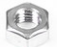                                                                                               |
| **Tools**                 |                                                                              |         |                                                                                                                                                                                                                                                                                                                                                                                          |
| 20                        | 3\*40MM Cross Screw Driver                                                   | 1       |                                                                                                                                                                                                                                                                                                                                          |
| 21                        | Map                                                                          | 1       |                                                                                                                                                                                                                                                                                                                                           |
| 22                        | 2\*40MM Screw Driver                                                         | 1       |                                                                                                                                                                                                                                                                                                                                           |

# 4. Micro:bit

Micro:bit, created by the BBC, aims at helping kids over 11 to gain insight to
programming. It is home to abundant resources like a 5\*5 LED, two programmable
buttons, compass, Micro USB port and Bluetooth module. It is the half size of
credit card, but mighty. Additionally, it can applied to video games, robots,
science experiments and so on.

The Micro:bit V2 consists of a touch sensitive logo, a MEMS microphone and a
buzzer at the back. The wave-shaped golden edge connectors can be attached to
other sensors or modules by alligator clips. Besides, you can press reset/power
button to activate sleep mode, so that the power consumption can be reduced. Its
CPU performance is better than V.15.

**Pin Diagram**

Micro:bit V1.5

The reset/ power button can reset the running program.

Hold it down, then the indicator will get dark; and release it, the sleep mode
will be activated.

More details:

https://tech.microbit.org/hardware/

https://microbit.org/new-microbit/

https://www.microbit.org/get-started/user-guide/overview/

https://microbit.org/get-started/user-guide/features-in-depth/

Official Website：<https://tech.microbit.org/hardware/edgeconnector/>

<https://microbit.org/guide/hardware/pins/>

**Precaution:**

1.  We suggest that you put silicone case on V2 Micro:bit to refrain from short
    circuit.

1.  The drive capacity of IO ports is weak; therefore, don’t connect component
    with large current(like MG995 servo, DC motor) in case V2 board gets
    damaged. You have to know about the working current of the component you
    use. Generally, we will attach a Micro:bit expansion board.

c. Supply power via USB and 3V battery socket. And it doesn’t support 5V
sensors. If you have to use 5V sensors, you can use Micro:bit expansion board.

d. The shared pins like P3, P4, P6, P7 and P10 of LED dot matrix should be
disabled in the code (use block
); otherwise, there will be
errors on LED dot matrix and data.

e. Don’t attach 3.3V batteries to battery socket; otherwise, V2 will be damaged.

f. Don’t operate it on metal products.

In terms of programming environment, the BBC provides the online programming
website：<https://microbit.org/code/>

## 4.1. Install the Driver of Micro:bit：

Enter the Micro:bit Driver folder (link: <https://fs.keyestudio.com/KS0426>

) to check how to install the driver of Micro:bit V2

## 4.2. Keyestudio Micro:bit Mini Smart Car

Rich in sensors and peripheral devices, Keyestudio micro:bit is a multipurpose
car based on micro:bit, which could help you learn how to use micro:bit and
electronics knowledge.

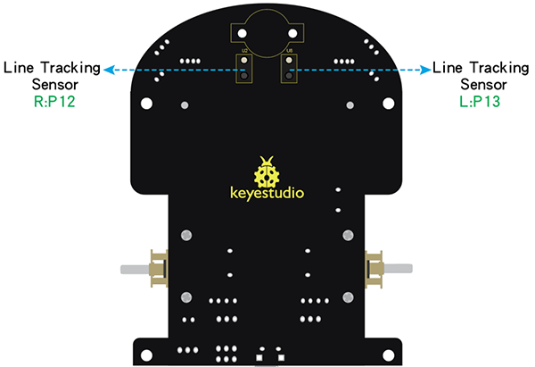

**Rechargeable Battery**

The keyestudio micro:bit smart car is supplied power by a 18650 battery or USB
port. The battery is rechargeable and maximum current is 700 mA.

Note: the battery is not included in this kit.

**Indicator**

Show the working status of keyestudio micro:bit smart car.

| LED  | Name                                               | LED on              | LED off                 |
|------|----------------------------------------------------|---------------------|-------------------------|
| D2   | Left line tracking sensor                          | Detect white object | Detect black line       |
| D6   | Right line tracking sensor                         | Detect white object | Detect black line       |
| SIG1 | Left obstacle avoidance sensor                     | Detect obstacles    | No obstacle is detected |
| SIG2 | Right obstacle avoidance sensor                    | Detect obstacles    | No obstacle is detected |
| POW  | Power indicator                                    |                     |                         |
| LED1 | LED1 is always on when the power is fully charged. |                     |                         |

**Potentiometer**

| **Potentiometer**                   | Adjust sensitivity                                                                                                                                                       |
|-------------------------------------|--------------------------------------------------------------------------------------------------------------------------------------------------------------------------|
| RP1 Right line tracking sensor      |  Put a paper under the bottom of car, adjust the RP1. When D2 is on, then pull up the universal wheels for 0.5cm off the paper. The sensitivity is set well if D2 is off |
| RP2 Left line tracking sensor       | Refer to RP1                                                                                                                                                             |
| RP5 Left obstacle avoidance sensor  | Keep left obstacle avoidance sensor about 5cm away the obstacle. Adjust the RP5 and SIGI is on. The sensitivity is set well if the obstacle is removed and SIGI is off   |
| RP9 Right obstacle avoidance sensor | Keep right obstacle avoidance sensor about 5cm away the obstacle. Adjust the RP9 and SIG2 is on. The sensitivity is set well if the obstacle is removed and SIG2 is off  |

## 4.3 Assembly Guide

Note: Peel the plastic film off the board first when installing the smart car.
To be honest, we never intend to send wood to you.

1\. Install base plate of micro:bit mini smart car

(Take out the two self-tapping screws of universal wheels first, we provide the
2 pcs longer self-tapping screws to replace them, and don’t screw them too
tightly）

1.  Mount the top board of micro:bit smart car

Install the base plate of mini smart robot

(Note：Install it after peeling off the protective film on acrylic board.)

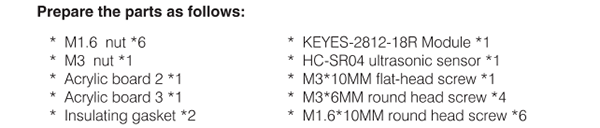

1.  Wiring

| Sensors/modules            | Pins | Shield |
|----------------------------|------|--------|
|  KEYES-2812-18R module     | G    | G      |
|                            | V    | V      |
|                            | D1   | D5     |
|  HC-SR04 Ultrasonic Sensor | Gnd  | G      |
|                            | Echo | D15    |
|                            | Trig | D14    |
|                            | Vcc  | 5V     |

1.  Install Micro:bit

# 5. Python

[https://learn.adafruit.com/micropython-basics-what-is-micropython -
faq-2792685](https://learn.adafruit.com/micropython-basics-what-is-micropython#faq-2792685)

What is MicroPython?

[MicroPython](https://www.micropython.org/) is a tiny open source [Python
programming language](https://www.python.org/) interpreter that runs on small
embedded development boards. With MicroPython you can write clean and simple
Python code to control hardware instead of having to use complex low-level
languages like C or C++ (what Arduino uses for programming).

The simplicity of the Python programming language makes MicroPython an excellent
choice for beginners who are new to programming and hardware. However
MicroPython is also quite full-featured and supports most of Python's syntax so
even seasoned Python veterans will find MicroPython familiar and fun to use.

More details please log in official micro:bit website:

https://microbit-micropython.readthedocs.io/en/latest/index.html

<https://microbit-micropython.readthedocs.io/en/latest/tutorials/introduction.html>

Python has two types of editors（web version and offline version)

1.  Web version: <https://python.microbit.org/v/1.1>

1.  The other one is the offline compiler tool
    \-----Mu

(Download Mu：<https://codewith.mu/en/download>)

Mu

Official Website：<https://codewith.mu/>

Mu, a Python code editor, is suitable for starters.

Mu doesn’t support 32-bit Windows. The latest version is Mu 1.1.0-beta 2

1.  Download Mu

Click“This PC”and right- click to select Properties to check the version of your
computer.

Below is shown system type of your computer.

Enter link: <https://codewith.mu/en/download> to download the corresponding
version of Mu.

Run and Install Mu

Find out the folder where Mu is downloaded and double-click file to install Mu

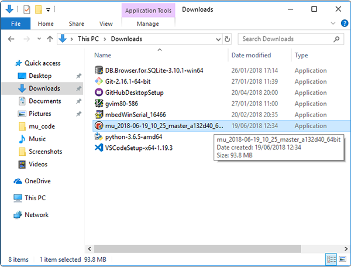

**Mac OSX：**<https://codewith.mu/en/howto/1.1/install_macos>

The installation method is similar.

Windows 10

We will demonstrate how to download Mu on Windows 10.

Tap“Run anyway”.

Confirm the version of Mu and tap“Next”.

Then select“I Agree”

Click“Next”and“Install”

You have to wait for a while until the installation is finished.

Finally, click“Finish”

Click Mu icon to get started.

Mu’s main interface is shown below:

# 6. Projects

The projects from 6.1 to 6.9 are the introduction of LED matrix and built-in
sensors on the micro:bit board.

## 6.1：Heartbeat

1.  **Description：**

Prepare a Micro:bit board and USB cable. Next we will conduct a basic experiment
that a heartbeat pattern flashes on micro:bit board.

What you need to get started

Link micro:bit board with computer via USB cable.

Open the offline version of Mu

1.  **Test Code：**

Open Mu software, click Mode, then click“BBC micro：bit”and“OK”

Tap“Load”, select“microbit-Heartbeat.py”file and click“open”

| File Type   | Route                          | File Name             |
|-------------|--------------------------------|-----------------------|
| Python file | ../Python Code/6.1：Heart beat | microbit-Heartbeat.py |

There is another way to import code. Open Mu software and drag
file“microbit-Heart beat.py”into it.

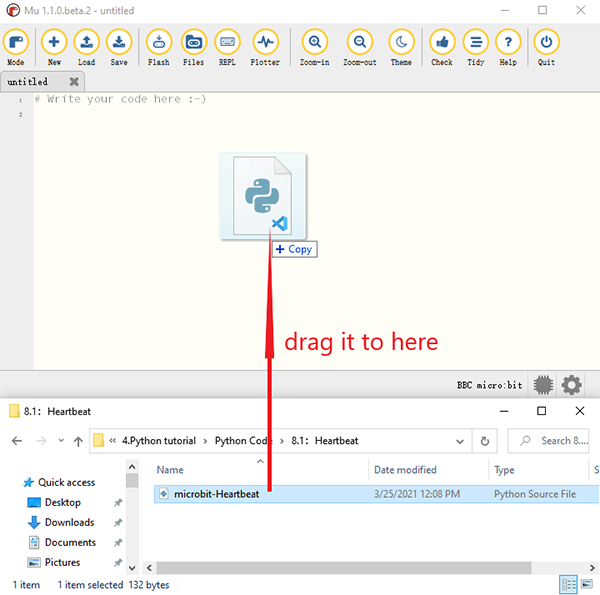

You can also input code in the editing window yourself.(note:all English words
and symbols must be written in English)

The following is a list of built-in images. If you are interested, you can
select one of the following built-in images to replace the "Image.HEART" in the
function show () in the figure above.

• Image.HEART

• Image.HEART_SMALL

• Image.HAPPY

• Image.SMILE

• Image.SAD

• Image.CONFUSED

• Image.ANGRY

• Image.ASLEEP

• Image.SURPRISED

• Image.SILLY

• Image.FABULOUS

• Image.MEH

• Image.YES

• Image.NO

• Image.CLOCK12, Image.CLOCK11, Image.CLOCK10, Image.CLOCK9, Image.CLOCK8,
Image.CLOCK7, Image.CLOCK6, Image.CLOCK5,

Image.CLOCK4, Image.CLOCK3, Image.CLOCK2,Image.CLOCK1

• Image.ARROW_N, Image.ARROW_NE, Image.ARROW_E, Image.ARROW_SE, Image.ARROW_S,
Image.ARROW_SW, Image.ARROW_W, Image.ARROW_NW

• Image.TRIANGLE

• Image.TRIANGLE_LEFT

• Image.CHESSBOARD

• Image.DIAMOND

• Image.DIAMOND_SMALL

• Image.SQUARE

• Image.SQUARE_SMALL

• Image.RABBIT

• Image.COW

• Image.MUSIC_CROTCHET

• Image.MUSIC_QUAVER

• Image.MUSIC_QUAVERS

• Image.PITCHFORK

• Image.PACMAN

• Image.TARGET

• Image.TSHIRT

• Image.ROLLERSKATE

• Image.DUCK

• Image.HOUSE

• Image.TORTOISE

• Image.BUTTERFLY

• Image.STICKFIGURE

• Image.GHOST

• Image.SWORD

• Image.GIRAFFE

• Image.SKULL

• Image.UMBRELLA

• Image.SNAKE，Image.ALL_CLOCKS，Image.ALL_ARROWS

Connect micro:bit board to computer with USB cable, click“Flash”to download code
to micro:bit board.

The code, even it is wrong, can be downloaded to micro:bit board successfully,
yet not working on micro:bit board.

Click“Flash”to download code to micro:bit.

Click“REPL”and press the reset button on micro:bit, the error information will
be displayed on REPL window, as shown below:

Click“REPL”again to turn off REPL mode, then you could refresh new code.

To make sure code correct, you only need to tap“Check”. The errors will be shown
on the window.

Modify the code according the prompt and click“Check”

More tutorials, log in website please:<https://codewith.mu/en/tutorials/>

**Test Result:**

After testing, click“Flash”and download code to micro:bit, plug in power with
USB cable. The micro:bit board
shows“❤”and“”in loop way

**Code Explanation：**

| **from**  microbit **import** \* | Import the library file of micro：bit                                 |
|----------------------------------|-----------------------------------------------------------------------|
| **while True:**                  | This is a permanent loop that makes micro:bit execute the code of it. |
| display.show(Image.HEART)        | micro：bit shows“❤”pattern                                            |
| sleep(500)                       | Delay in 500ms                                                        |
| display.show(Image.HEART_SMALL)  | micro：bit displays“”  |

## 6.2：Light Up A Single LED

1.  **Description：**

Micro:bit motherboard consists of 25 light-emitting diodes, 5 pcs in a group.
They correspond to x and y axis, therefore, the 5\*5 matrix is formed. Moreover,
every diode locates at the point of x and y axis.

Virtually, we could control a LED by setting coordinate points. For instance,
set coordinate point（0，0）to turn on the LED at row 1 and column 1; light up
LED at the row 1 and column 3, we could set（2，0) and so on.

1.  **What you need to get started**

2.  Link micro:bit board with computer via USB cable.

3.  Open the offline version of Mu

**3. Test Code：**

Enter Mu software and open the file“microbit-Light up an LED .py”to import
code:（[How to load the project code?](#AS)）

| Type        | Route                               | File Name                    |
|-------------|-------------------------------------|------------------------------|
| Python file | ../Python code/6.2：Light up an LED | microbit-Light up an LED .py |

You can also input code in the editing window yourself.(note: all English words
and symbols must be written in English)

Click“Check”to examine error in the code. The program proves wrong if underlines
and cursors are shown.

If the code is correct, connect micro:bit to computer and click“Flash”to
download code to micro:bit board

**4. Test Result：**

After downloading code, plug in power with USB cable, you will see the LED
at(1,0) flashes for 0.5s then the LED at (3,4) blinks for 0.5s, in loop way.

**5.Code Explanation：**

| **from** microbit **import** \*                                                                                                                                             | import the library file of micro:bit                                                                                                                                                                                                                                                   |
|-----------------------------------------------------------------------------------------------------------------------------------------------------------------------------|----------------------------------------------------------------------------------------------------------------------------------------------------------------------------------------------------------------------------------------------------------------------------------------|
| val1 = Image("09000:""00000:""00000:""00000:""00000:")      val2 = Image("00000:""00000:""00000:""00000:""00090:")  val3 = Image("00000:""00000:""00000:""00000:""00000:")  | Set Image() to val1 Set pixel of LED on micro:bit to the value in 0\~9  Pixel of each LED on micro:bit can be set in one of ten values If set pixel to 0 (zero) ，which means in close state, literally, 0 is brightness, 9 is best brightness Set Image() to val2 Set Image() to val3 |
| **while True:**                                                                                                                                                             | This is a permanent loop that makes micro:bit execute the code of it.                                                                                                                                                                                                                  |
| display.show(val1)  sleep(500)  display.show(val3)  sleep(500)                                                                                                              |  LED at (1,0) blinks for 0.5s                                                                                                                                                                                                                                                          |
| display.show(val2)  sleep(500)  display.show(val3)  sleep(500)                                                                                                              |  LED at (3,4) flashes for 0.5s                                                                                                                                                                                                                                                         |

1.  Reference

sleep(ms) : delay time

For more details about delay, please refer to[:
https://microbit-micropython.readthedocs.io/en/latest/utime.html](:%20https:/microbit-micropython.readthedocs.io/en/latest/utime.html)

## 6.3：5\* 5 LED Dot Matrix

1.  **Description：**

Dot matrix gains popularity in our life, such as LED screen, bus station and the
mini TV in the lift.

The dot matrix of Micro:bit board consists of 25 light emitting diodes. In
previous lesson, we control LED of Micro:bit board to form patterns, numbers and
character strings by setting the coordinate points. Moreover, we could adopt
another way to complete the display of patterns, numbers and character strings.

1.  **What you need to get started**

1.  Link micro:bit board with computer via USB cable.

2.  Open the offline version of Mu

**3. Test Code：**

**Code 1：**

You could open“Code 1.py”file to Import code （[How to load the project
code?](#AS)）

| File Type   | Route                                  | File Name |
|-------------|----------------------------------------|-----------|
| Python file | ../Python code/6.3：5×5 LED Dot Matrix | Code 1.py |

You can also input code in the editing window yourself.(note:all English words
and symbols must be written in English)

Click“Check”to examine error in the code. The program proves wrong if underlines
and cursors are shown.

 If the code is correct, connect
micro:bit to computer and click“Flash”to download code to micro:bit board

**Code 2：**

Enter Mu software and open“Code 2.py“file to import code（[How to load the
project code?](#AS)）

| File Type   | Route                                  | File Name |
|-------------|----------------------------------------|-----------|
| Python file | ../Python code/6.3：5×5 LED Dot Matrix | Code 2.py |

You can also input code in the editing window yourself.(note:all English words
and symbols must be written in English)

Click“Check”to examine error in the code. The program proves wrong if underlines
and cursors are shown.

If the code is correct, connect micro:bit to computer and click“Flash”to
download code to micro:bit board.

**4. Test Result：**

Download code 1 to micro:bit and keep USB cable connected , we will see the
 icon.

Download code 2. Micro: bit starts showing number 1, 2, 3, 4, and 5, then
cyclically display,“Hello!”,
,
,
,
 and
patterns.

**5. Code Explanation：**

| **from** microbit **import** \*                                                                                      | import the library file of micro:bit                                                                                                  |
|----------------------------------------------------------------------------------------------------------------------|---------------------------------------------------------------------------------------------------------------------------------------|
| val = Image("09000:""00000:""00000:""00000:""00000:")                                                                |  Set Image() to variable val                                                                                                          |
| display.show(val)                                                                                                    | micro:bit shows“→”                                                                                                                    |
| display.show('1')                                                                                                    | micro:bit shows“1”                                                                                                                    |
| sleep(500)                                                                                                           | Delay in 500ms                                                                                                                        |
| display.scroll("hello!")                                                                                             | micro:bit scrolls to show“hello!”                                                                                                     |
| display.show(Image.HEART)                                                                                            | micro:bit displays“❤”pattern                                                                                                          |
| display.show(Image.ARROW_NE) display.show(Image.ARROW_SE) display.show(Image.ARROW_SW)  display.show(Image.ARROW_NW) | micro:bit shows“Northeast”arrow micro:bit displays“Southeast”arrow micro:bit shows“Southwest”arrow micro:bit displays“Northwest”arrow |
| display.clear()                                                                                                      | The LED dot matrix of micro:bit clears                                                                                                |

**6. Reference：**

display.scroll() ：scroll to display the value on screen. If the value is
integer or float, transfer it into character string via str（）.

The display scrolls to show the values, if it is integer or float, we use
str（）to transfer into character strings.

More details, please refer to
<https://microbit-micropython.readthedocs.io/en/latest/utime.html>

## 6.4：Programmable Buttons

1.  **Description：**

The button can control the on and off of the circuit. The button is attached to
the circuit. The circuit is disconnected when the button is not pressed. The
circuit is connected as soon as it is pressed, but it is disconnected after
being released.

Both ends of button are like two mountains. There is a river in between.

The internal metal piece connect the two sides to let the current pass, just
like building a bridge to connect the two mountains.

Micro:bit board has three buttons, the reset button on the back and two
programmable buttons on the front. By pressing these buttons, the corresponding
characters will be displayed on dot matrix.

**2. What you need to get started**

1.  Link micro:bit board with computer via USB cable.

2.  Open the offline version of Mu

**3. Test Code：**

**Code 1：**

Open the file“Code 1.py“ in Mu software，（[How to load the project
code?](#AS)）

| File Type   | Route                                    | File Name |
|-------------|------------------------------------------|-----------|
| Python file | ../Python code/6.4：Programmable Buttons | Code 1.py |

You can also input code in the editing window yourself.(note:all English words
and symbols must be written in English)

Click“Check”to examine error in the code. The program proves wrong if underlines
and cursors are shown.

If the code is correct, connect micro:bit to computer and click“Flash”to
download code to micro:bit board.

Then tap“Flash”to download code to micro:bit.

**Code 2：**

Open the file“Code 2.py”in Mu，

（[How to load the project code?](#AS)）

| File Type   | Route                                 | File Name |
|-------------|---------------------------------------|-----------|
| Python file | ../Projects/6.4：Programmable Buttons | Code 2.py |

You can also input code in the editing window yourself.(note:all English words
and symbols must be written in English)

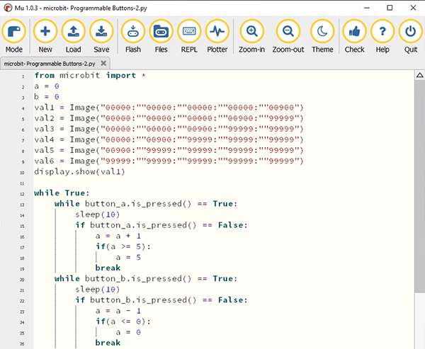

Click“Check”to examine error in the code. The program proves wrong if underlines
and cursors are shown.

If the code is correct, connect micro:bit to computer and click“Flash”to
download code to micro:bit board. Then click“Flash”to download code to micro:bit
board.

**4.Test Result：**

Upload code 1 and plug in micro:bit via USB cable, press“A”on Micro:bit board,
character“A”will be displayed；in case that B is pressed，letter“B”will appear.
So will show“AB”if you press A and B buttons simultaneously.

Upload code 2 and plug in board via USB cable. Press button A, a row of luminous
LEDs are added, when B is pressed, a row of luminous LEDs are deducted.

**5.Code Explanation：**

| **from** microbit **import** \*                                                                                                                                                                                                                                                                                                                                                                                                                                                               | import the library file of micro:bit                                                                                                                                                                                                                                                                                                                                                                                                                                                                                                                                                         |
|-----------------------------------------------------------------------------------------------------------------------------------------------------------------------------------------------------------------------------------------------------------------------------------------------------------------------------------------------------------------------------------------------------------------------------------------------------------------------------------------------|----------------------------------------------------------------------------------------------------------------------------------------------------------------------------------------------------------------------------------------------------------------------------------------------------------------------------------------------------------------------------------------------------------------------------------------------------------------------------------------------------------------------------------------------------------------------------------------------|
| **while True:**                                                                                                                                                                                                                                                                                                                                                                                                                                                                               | This is a permanent loop that makes micro:bit execute the code of it.                                                                                                                                                                                                                                                                                                                                                                                                                                                                                                                        |
| **if** button_a.is_pressed(): display.show("A") **elif** button_a.is_pressed() **and** button_b.is_pressed(): display.scroll("AB") **elif** button_b.is_pressed(): display.show("B")                                                                                                                                                                                                                                                                                                          | If button A is pressed micro:bit shows“A” If button A and B are pressed at same time micro:bit displays“AB” If button B is pressed micro:bit shows“B”                                                                                                                                                                                                                                                                                                                                                                                                                                        |
| **while** button_a.is_pressed() == **True**: sleep(10) **if** button_a.is_pressed() == **False**: a = a + 1 **if**(a \>= 5): a = 5 break **while** button_b.is_pressed() == **True**: sleep(10) **if** button_b.is_pressed() == **False**: a = a - 1 **if**(a \<= 0): a = 0 break **if** a == 0: display.show(val1) **if** a == 1: display.show(val2) **if** a == 2: display.show(val3) **if** a == 3: display.show(val4) **if** a == 4: display.show(val5) **if** a == 5: display.show(val6) | When the button A is pressed Delay in 10ms to eliminate the shaking of button A when button A is released, Variable a adds 1 If variable a≥5 Variable a=5 exit the loop  when button B is pressed Delay in 10ms to eliminate the shaking of button B When the button B is released Variable a reduces 1 gradually When a≤0 Variable a=0 exit the loop When a=0 micro:bit shows pattern val1 When a=1 micro:bit displays pattern val2 When a=2 micro:bit shows pattern val3 If a=3 micro:bit displays pattern val4 If a=4 micro:bit shows pattern val5 If a=5 micro:bit displays pattern val6 |

## 6.5: Temperature Measurement

1.  **Description：**

Micro:bit main board contains temperature sensor, as micro:bit is small
pocket-sized computer, it has a micro processor. That means this is a tiny
electronic component with less power than normal computer processor, which is
one of the reason your micro：bit is so small and can run on batteries.

The micro:bit processor runs the program you create for your micro:bit so when
you write a program in online editors, then transfer it to your micro:bit. The
processor is where your program runs.

**Note: the temperature sensor is included in the processor.**

**What you need to get started**

1.  Link micro:bit board with computer via USB cable.

2.  Open the offline version of Mu

**3. Test Code：**

**Code 1：**

Open“Code 1.py“ file in Mu，

（[How to load the project code?](#AS)）

| File Type   | Route                                         | File Name |
|-------------|-----------------------------------------------|-----------|
| Python file | ../Python code/6.5：Temperature Measurement / | Code 1.py |

You can also input code in the editing window yourself.(note:all English words
and symbols must be written in English)

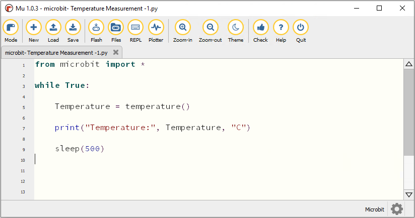

Click“Check”to examine error in the code. The program proves wrong if underlines
and cursors are shown. 

If the code is correct, connect micro:bit to computer and click“Flash”to
download code to micro:bit board.

After downloading test code 1 to micro:bit board, keep USB connected and
click**“REPL”and press the reset button on micro:bit.** Then REPL window will
show the ambient temperature value, as shown below:( C stands for temperature
unit)

**Code 2：**

Open“Code 2.py” in Mu，

（[How to load the project code?](#AS)）

| File Type   | Route                                        | File Name |
|-------------|----------------------------------------------|-----------|
| Python file | ../Python code/6.5：Temperature Measurement  | Code 2.py |

Or, you could input code in the editing window by yourself.

The temperature value can be set in compliance with the real temperature.

Click“Check”to examine error in the code. The program proves wrong if underlines
and cursors are shown. 

If the code is correct, connect micro:bit to computer and click“Flash”to
download code to micro:bit board

**4.Test Result：**

Upload the code 2 plug in micro:bit via USB cable, when the ambient temperature
is less than 35℃, 5\*5LED will
show. When the temperature is
equivalent to or greater than 35℃, the
pattern will appear.

**5.Code Explanation：**

| **from** microbit **import** \*                                                                     | import the library file of micro:bit                                                                                                         |
|-----------------------------------------------------------------------------------------------------|----------------------------------------------------------------------------------------------------------------------------------------------|
| **while True:**                                                                                     | This is a permanent loop that makes micro:bit execute the code of it.                                                                        |
| Temperature = temperature()                                                                         | Set temperature() to Temperature                                                                                                             |
| print("Temperature:", Temperature, "C")                                                             | BBC micro:bit REPL prints temperature value                                                                                                  |
| sleep(500)                                                                                          | Delay in 500ms                                                                                                                               |
| **if** temperature() \>= 35: display.show(Image.HEART)  **else**:  display.show(Image.HEART_SMALL)  | If temperature value ≥35℃  micro:bit shows“♥” If temperature value\<35℃  micro:bit displays“” |

## 6.6：Micro:bit’s Compass

**1. Description：**

This project mainly introduces the use of the Micro:bit’s compass. In addition
to detecting the strength of the magnetic field, it can also be used to
determine the direction, an important part of the heading and attitude reference
system (AHRS) as well.  
It uses FreescaleMAG3110 three-axis magnetometer. Its I2C interface communicates
with the outside, the range is ±1000µT, the maximum data update rate is 80Hz.
Combined with accelerometer, it can calculate the position. Additionally, it is
applied to magnetic detection and compass blocks.

Then we could read the value detected by it to determine the location. We need
to calibrate the Micro:bit board when magnetic sensor works.

The correct calibration method is to rotate the Micro:bit board.

In addition, the objects nearby may affect the accuracy of readings and
calibration.

1.  **What you need to get started**

2.  Link micro:bit board with computer via USB cable.

3.  Open the offline version of Mu

**3. Test Code：**

**Code 1：**

**When the button A is pressed, the window displays the value of compass.**

Open file“Code 1.py“ in Mu，

（[How to load the project code?](#AS)）

| File Type   | Route                                   | File Name |
|-------------|-----------------------------------------|-----------|
| Python file | ../Python code/6.6：Micro:bit’s Compass | Code 1.py |

You can also input code in the editing window yourself.(Note:all English words
and symbols must be written in English)

Click“Check”to examine error in the code. The program proves wrong if underlines
and cursors are shown. 

If the code is correct, connect micro:bit to computer and click“Flash”to
download code to micro:bit board

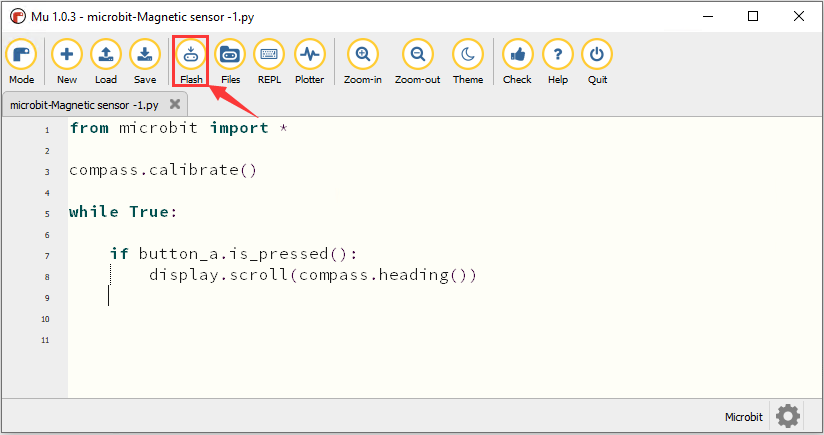

**Code Explanation：**

We need to calibrate micro：bit due to different magnetic field in different
areas. Micro:bit will prompt you to calibrate when you use it first time.

Transfer code 1 to micro:bit, plug in micro:bit via USB cable and press button
A.“TILT TO FILL SCREEN”appears on micro:bit. Then enter the calibration
interface, the calibration method is to rotate the micro:bit board and display a
full square pattern(25 LEDs are on), as shown in the following figure:

The calibration is finished until you view the smile
patternappear.

The serial monitor will show 0°, 90°, 180°and 270° when pressing A.

**Code 2：**

Make micro: bit board point to the north, south, east and west horizontally ,
LED dot matrix displays the corresponding direction patterns.

For the above picture, the arrow pointing to the upper right when the value
ranges from 292.5 to 337.5. 0.5 can’t be input in the code, thereby, the values
we get are 293 and 338

Open“Code 2.py“ file in Mu，

（[How to load the project code?](#AS)）

| File Type   | Route                                   | File Name |
|-------------|-----------------------------------------|-----------|
| Python file | ../Python code/6.6：Micro:bit’s Compass | Code 2.py |

Or, you could input code in the editing window by yourself.

Click“Check”to examine error in the code. The program proves wrong if underlines
and cursors are shown. 

If the code is correct, connect micro:bit to computer and click“Flash”to
download code to micro:bit board

**4.Test Result：**

Upload code 2 onto micro:bit board and don’t plug off USB cable. After
calibration, tilt Micro:bit board, the LED dot matrix displays the direction
signs.

**5.Code Explanation：**

| **from** microbit **import** \*                                                                                                                                                                                                                                                                                                                                                                                                                                                                         | import the library file of micro:bit                                                                                                                                                                                                                                                                                   |
|---------------------------------------------------------------------------------------------------------------------------------------------------------------------------------------------------------------------------------------------------------------------------------------------------------------------------------------------------------------------------------------------------------------------------------------------------------------------------------------------------------|------------------------------------------------------------------------------------------------------------------------------------------------------------------------------------------------------------------------------------------------------------------------------------------------------------------------|
| compass.calibrate()                                                                                                                                                                                                                                                                                                                                                                                                                                                                                     | Compass calibration                                                                                                                                                                                                                                                                                                    |
| **while True:**                                                                                                                                                                                                                                                                                                                                                                                                                                                                                         | This is a permanent loop, which makes micro:bit execute the code of it.                                                                                                                                                                                                                                                |
| **if** button_a.is_pressed():  display.scroll(compass.heading())                                                                                                                                                                                                                                                                                                                                                                                                                                        | When the button A is pressed Micro:bit scrolls to show the value of compass                                                                                                                                                                                                                                            |
| x = 0                                                                                                                                                                                                                                                                                                                                                                                                                                                                                                   | Set variable x=0                                                                                                                                                                                                                                                                                                       |
| x = compass.heading()                                                                                                                                                                                                                                                                                                                                                                                                                                                                                   | Set the value of compass to variable x                                                                                                                                                                                                                                                                                 |
| if...else if...else                                                                                                                                                                                                                                                                                                                                                                                                                                                                                     | Condition judgement statement:if...else if...else                                                                                                                                                                                                                                                                      |
| display.show(Image("00999:""00099:""00909:""09000:""90000")) display.show(Image("99900:""99000:""90900:""00090:""00009")) display.show(Image("00900:""09000:""99999:""09000:""00900")) display.show(Image("00009:""00090:""90900:""99000:""99900")) display.show(Image("00900:""00900:""90909:""09990:""00900")) display.show(Image("90000:""09000:""00909:""00099:""00999")) display.show(Image("00900:""00090:""99999:""00090:""00900")) display.show(Image("00900:""09990:""90909:""00900:""00900")) |     Micro:bit shows the Northeast arrow sign Micro:bit shows the Northwest arrow sign Micro:bit shows the west arrow sign Micro:bit shows the Southwest arrow sign Micro:bit shows the South arrow sign Micro:bit shows the South arrow sign  Micro:bit shows the East arrow sign Micro:bit shows the North arrow sign |

## 6.7: Accelerometer

**1. Description：**

The micro:bit V2 has a built-in LSM303AGR accelerometer, with the 8, 10 and 12
resolution.

We use an accelerometer to detect the posture of machine.

We will make the accelerometer to detect a few postures and check its initial
value at x, y and z axis.

**2. What you need to get started**

1.  Link micro:bit board with computer via USB cable.

2.  Open the offline version of Mu

**3. Test Code：**

**Code 1：**

Open“Code 1.py” file in Mu

（[How to load the project code?](#AS)）

| File Type   | Route                             | File Name |
|-------------|-----------------------------------|-----------|
| Python file | ../Python code/6.7：Accelerometer | Code 1.py |

You can also input code in the editing window yourself.(note:all English words
and symbols must be written in English)

Click“Check”to examine error in the code. The program proves wrong if underlines
and cursors are shown.

If the code is correct, connect micro:bit to computer and click“Flash”to
download code to micro:bit board

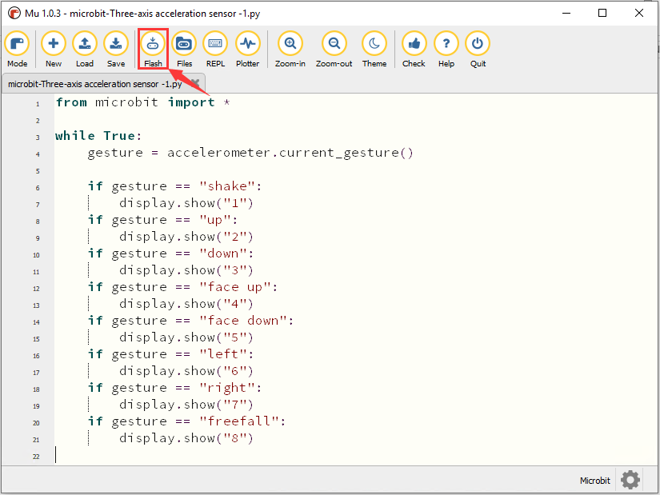

**Code 2：**

**Detect different acceleration values on X, Y and Z axis.**

Open file“Code 2.py”in Mu.

（[How to load the project code?](#AS)）

| File Type   | Route                             | File Name |
|-------------|-----------------------------------|-----------|
| Python file | ../Python code/6.7：Accelerometer | Code 2.py |

You can also input code in the editing window yourself.

(Note:all English words and symbols must be written in English)

Click“Check”to examine error in the code. The program proves wrong if underlines
and cursors are shown.

If the code is correct, connect micro:bit to computer and click“Flash”to
download code to micro:bit board.

Look up the MMA8653FC manual

The coordinates of the Micro:bit accelerometer are shown in the following
figure:

The value of acceleration on the X-axis, Y-axis, and Z-axis, as well as the
synthesis of acceleration (the synthesis of gravitational acceleration and other
external forces). Then flip the micro:bit board, the data is shown below:

Download code 2 onto micro:bit board, and don’t pull off the USB cable.

Click“REPL”and press the reset button. The value of acceleration on X axis, Y
axis and Z axis are shown below

**4. Test Result：**

Download code 1 to micro:bit board and plug in power with USB cable shake the
Micro:bit board then the number 1 appears.

When the logo points to the North, the number 2 will be displayed:

When the logo points to the South, the number 3 will be displayed:

When the LED dot matrix faces up, the number 4 will be shown.

However, when dot matrix faces down, the number 5 will be displayed.

When the micro:bit is tilt to the left, the number 6 will be shown.

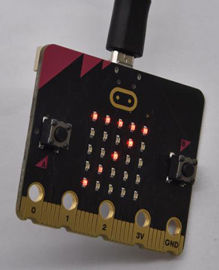

Yet, the board is inclined to the right, the number 7 is displayed.

When the micro:bit is free fall(accidentally making it fall), the number 8 will
appear. （Note：we don’t recommend you to make it free fall because board will
get damaged)

**5.Code Explanation：**

| **from** microbit **import** \*                                                                                                                                                                                                                                                                                                                                                              | import the library file of micro:bit                                                                                                                                                                                                                                                                                                                                                                                                                                                                                                       |
|----------------------------------------------------------------------------------------------------------------------------------------------------------------------------------------------------------------------------------------------------------------------------------------------------------------------------------------------------------------------------------------------|--------------------------------------------------------------------------------------------------------------------------------------------------------------------------------------------------------------------------------------------------------------------------------------------------------------------------------------------------------------------------------------------------------------------------------------------------------------------------------------------------------------------------------------------|
| gesture = accelerometer.current_gesture()                                                                                                                                                                                                                                                                                                                                                    | Set accelerometer.current_gesture() to gesture                                                                                                                                                                                                                                                                                                                                                                                                                                                                                             |
| **while True:**                                                                                                                                                                                                                                                                                                                                                                              | This is a permanent loop that makes micro:bit execute the code of it.                                                                                                                                                                                                                                                                                                                                                                                                                                                                      |
| **if** gesture == "shake":  display.show("1")  **if** gesture == "up":  display.show("2")  **if** gesture == "down":  display.show("3")  **if** gesture == "face up":  display.show("4")  **if** gesture == "face down":  display.show("5")  **if** gesture == "left":  display.show("6")  **if** gesture == "right":  display.show("7")  **if** gesture == "freefall":  display.show("8")   | Shaking micro:bit board, number 1 will appear When log points to the North, number 2 will show up. When log points to the South, number 3 will be shown When the LED dot matrix is upward, the number 4 is shown. the number 5 is displayed when the LED dot matrix is downward. When Micro:bit board is tilt to the left, number 6 is shown. When micro:bit is tilt to the right When Micro:bit board is inclined to the right, number 7 is displayed. When it is free fall(accidentally making it fall), number 8 appears on dot matrix. |
| x = accelerometer.get_x()  y = accelerometer.get_y()  z = accelerometer.get_z()                                                                                                                                                                                                                                                                                                              | Read the acceleration value on x axis，the return value is integer, and set x= the read value on x axis Read the acceleration value on y axis，the return value is integer, and set y= the read value on y axis Read the acceleration value on z axis，the return value is integer, and set z= the read value on z axis                                                                                                                                                                                                                    |
| print("x, y, z:", x, y, z)                                                                                                                                                                                                                                                                                                                                                                   | The value of acceleration will be shown                                                                                                                                                                                                                                                                                                                                                                                                                                                                                                    |
| sleep(100)                                                                                                                                                                                                                                                                                                                                                                                   | Delay in 100ms                                                                                                                                                                                                                                                                                                                                                                                                                                                                                                                             |

## 6.8: Detect Light Intensity by micro:bit

1.  **Description：**

This project will introduce how micro:bit detects the external light intensity.
Since Micro:bit doesn’t come with photosensitive sensor, the detection of light
intensity is completed through the LED matrix. When the light irradiates the LED
matrix, the voltage change will be produced. Therefore, we could determine the
light intensity by voltage change.

**What you need to get started**

1.  Link micro:bit board with computer via USB cable.

2.  Open the offline version of Mu

1.  **Test Code：**

Open“microbit-Detect Light Intensity by Micro:bit .py” file in Mu
software，（[How to load the project code?](#AS)）

| File Type   | Route                                                    | File Name                                        |
|-------------|----------------------------------------------------------|--------------------------------------------------|
| Python file | ../Python code/6.8：Detect Light Intensity by Micro:bit  | microbit-Detect Light Intensity by Micro:bit .py |

You can also input code in the editing window yourself.

(Note:all English words and symbols must be written in English)

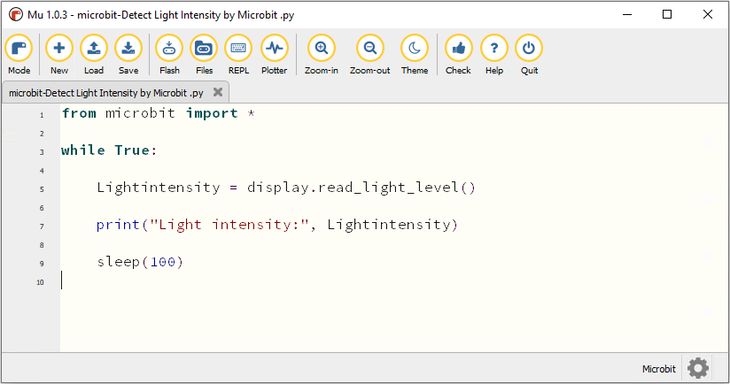

Click“Check”to examine error in the code. The program proves wrong if underlines
and cursors are shown. 

If the code is correct, connect micro:bit to computer and click“Flash”to
download code to micro:bit board.

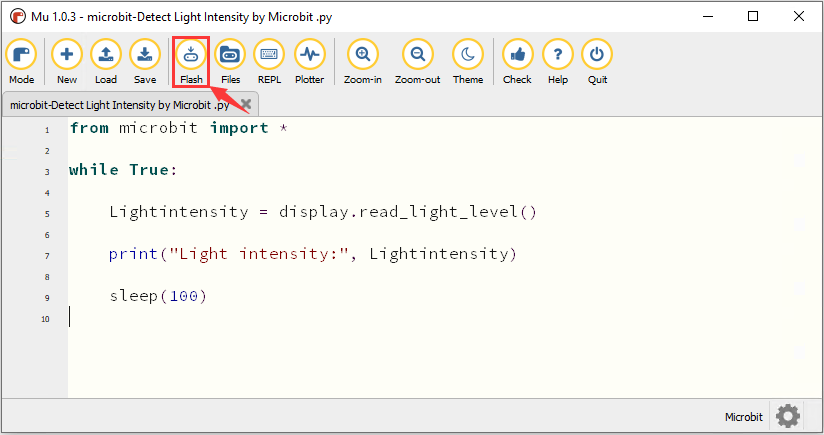

1.  **Test Result：**

Download code onto micro:bit board, don’t plug off USB cable. Click “REPL”and
press the reset buttons, the light intensity value will be displayed, as shown
below.

Covering the LED dot matrix, the intensity value is 0; on the contrary, the
intensity value increases when placing micro:bit board under the sun.

**5.Code Explanation：**

| **from** microbit **import** \*             | import the library file of micro:bit                        |
|---------------------------------------------|-------------------------------------------------------------|
| gesture = accelerometer.current_gesture()   | Set accelerometer.current_gesture() to gesture              |
| **while True:**                             | This is permanent loop, and micro bit executes the code     |
| Lightintensity = display.read_light_level() | Set display.read_light_level() to Lightintensity            |
| print("Light intensity:", Lightintensity)   | BBC microbit REPL prints the detected light intensity value |
| sleep(100)                                  | Delay in 100ms                                              |

## 6.9: Speaker

1.  **Description：**

There is a built-in speaker in the micro:bit board. The speaker can help you
make a number of interesting projects, like playing song“Ode to Joy”.

1.  **Preparation：**

2.  Attach the micro:bit to your computer

3.  Enter the offline Mu software

1.  **Test Code：**

Open“microbit-Speaker .py”in Mu,（[How to load the project code?](#AS)）

| File Type   | Route                       | File Name           |
|-------------|-----------------------------|---------------------|
| Python file | ../Python code/6.9：Speaker | microbit-Speaker.py |

You can also input code in the editing window yourself.(note:all English words
and symbols must be written in English)

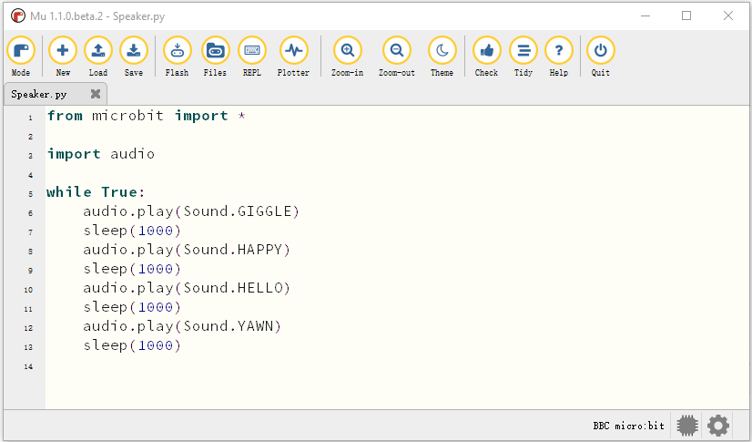

Click“Check”to examine errors in the code. If underlines and cursors are shown
under the code, which means wrong program.

If the code is correct, connect micro:bit to computer and click“Flash”to
download code to micro:bit board

**4.Test Result：**

Download code to micro:bit and attach USB cable to power. Then the micro:bit
will emit a sound .

**5. Code Explanation：**

| **from**  microbit  **import** \* | Import the library of the micro：bit                                           |
|-----------------------------------|--------------------------------------------------------------------------------|
| **import** audio                  | Audio library                                                                  |
| **while True:**                   | This is an infinite loop which makes the micro:bit permanently drive this code |
| audio.play(Sound.GIGGLE)          | Emit“giggle”sound                                                              |
| sleep(1000)                       | Delay in 1000ms                                                                |

## 6.10: Touch Sensitive Logo

1.  **Description：**

The touch sensitive logo is seen as an input(button). In fact, inside in the
micro:bit embeds a capacitive touch sensor. It can sensor your touch and trigger
a series of actions.

1.  **Preparation：**

(1) Link micro:bit board with computer via USB cable.

(2) Open the offline version of Mu

**3. Test Code：**

Open the“microbit-Touch Sensitive Logo .py“ file in Mu,（[How to load the
project code?](#AS)）

| File Type   | Route                                     | File Name                        |
|-------------|-------------------------------------------|----------------------------------|
| Python file | ../Python code/6.10：Touch Sensitive Logo | Microbit-Touch Sensitive Logo.py |

You can also input code in the editing window yourself.(note:all English words
and symbols must be written in English)

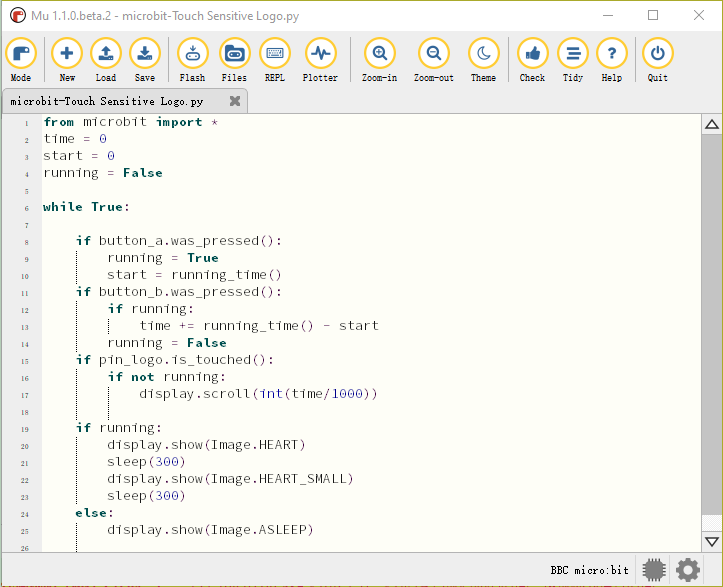

Click“Check”to examine errors in the code. If underlines and cursors are shown
under the code, which means wrong program.

If the code is correct, connect micro:bit to computer and click“Flash”to
download code to micro:bit board

**4.Test Result：**

When you press button A, LED will show heart beat icon; and the button B is used
to stop showing the image. In addition, touch logo then the micro:bit will count
time as a stopwatch; press the reset button to restart counting time.

## 6.11: Microphone

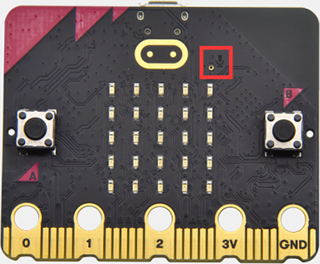

**1. Description：**

The micro:bit V2 includes a built-in microphone which can detect the sound
intensity. Additionally, there is a microphone LED indicator at the back. Its
indicator will turn on if you clap your hands; therefore, we can make an analog
noise detection watch.

**2. Preparation：**

1.  Attach the micro:bit to your computer

2.  Enter the offline Mu software

**3. Test Code：**

Code 1：

Open the file“microbit-Microphone-1.py”in Mu,（[How to load the project
code?](#AS)）

| File Type   | Route                           | File Name                |
|-------------|---------------------------------|--------------------------|
| Python file | ../Python code/6.11：Microphone | microbit-Microphone-1.py |

You can also input code in the editing window yourself.(note:all English words
and symbols must be written in English)

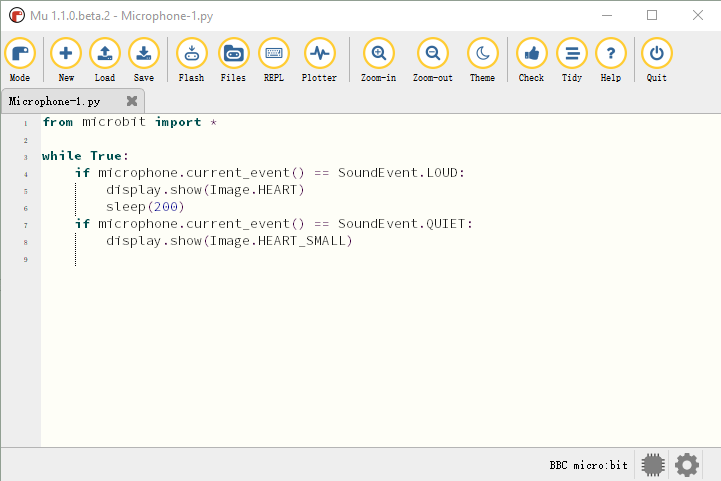

Click“Check”to examine errors in the code. If underlines and cursors are shown
under the code, which means wrong program.

If the code is correct, connect micro:bit to computer and click“Flash”to
download code to micro:bit board.

Download code 1 to the micro:bit and attach USB cable to power. The micro:bit
will display“❤”image when you clap your hands; however, it will
show“”when you are in the quiet
environment.

**Code 2：**

Open the file“microbit- Microphone -2.py“ in Mu,（[How to load the project
code?](#AS)）

| File Type   | Route                           | File Name                   |
|-------------|---------------------------------|-----------------------------|
| Python file | ../Python code/6.11：Microphone | Micro:bit- Microphone -2.py |

You can also input code in the editing window yourself.

(Note:all English words and symbols must be written in English)

Click“Check”to examine errors in the code. If underlines and cursors are shown
under the code, which means wrong program.

If the code is correct, connect micro:bit to computer and click“Flash”to
download code to micro:bit board.

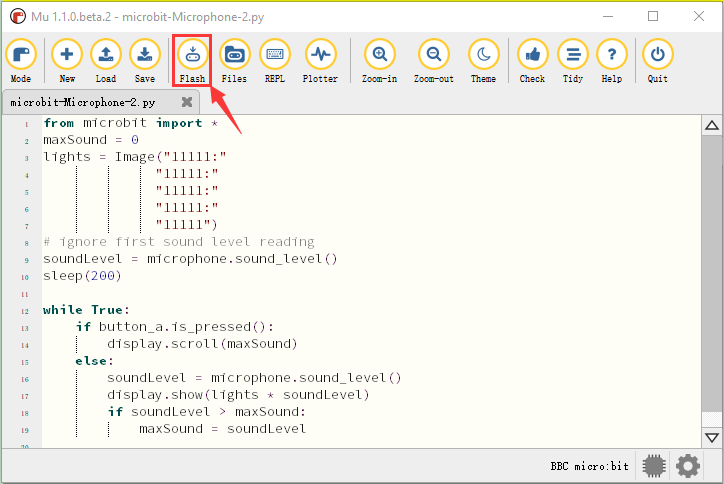

**4.Test Result：**

Download code to the micro:bit, plug in power with USB cable. When you press
button A, the LED dot matrix will show the maximum sound value( reset the
maximum value via reset button). The louder the detected sound, the brighter the
LED dot matrix

**5.Code Explanation：**

| **from**  microbit  **import** \*                                                                                                                                                  | Import the library of micro：bit                                                                                                                                                                                                                                                                       |
|------------------------------------------------------------------------------------------------------------------------------------------------------------------------------------|--------------------------------------------------------------------------------------------------------------------------------------------------------------------------------------------------------------------------------------------------------------------------------------------------------|
| **while True:**                                                                                                                                                                    | This is an infinite loop which makes the micro:bit permanently drive this code                                                                                                                                                                                                                         |
| if microphone.current_event() == SoundEvent.LOUD: display.show(Image.HEART) sleep(200) if microphone.current_event() == SoundEvent.QUIET: display.show(Image.HEART_SMALL)          | When microphone detects the sound LED displays“❤” Delay in 200ms If the sounding environment is quiet LED shows “”                                                                                                                                      |
| print("Light intensity:", Lightintensity)                                                                                                                                          | BBC micro:bit REPL prints the detected light intensity value                                                                                                                                                                                                                                           |
| maxSound = 0                                                                                                                                                                       | The initial value of the variable maxSound is 0                                                                                                                                                                                                                                                        |
| lights = Image("11111:""11111:""11111:""11111:""11111")                                                                                                                            |  Set Image() to variable lights                                                                                                                                                                                                                                                                        |
| soundLevel = microphone.sound_level()                                                                                                                                              | Set microphone.sound_level() to variable soundLevel                                                                                                                                                                                                                                                    |
| if button_a.is_pressed(): display.scroll(maxSound) else: soundLevel = microphone.sound_level() display.show(lights \* soundLevel) if soundLevel \> maxSound: maxSound = soundLevel | when the button A is pressed LED matrix shows the sound value If not Set microphone.sound_level() to variable soundLevel The LED dot matrix acts like the breathing light If sound level value is greater than the maximum sound value. The maximum sound value is equivalent to the sound level value |

## 6.12: Bluetooth Wireless Communication

Micro:bit board comes with NRF51822 processor, Bluetooth and 2.4GHz RF antenna,
which work with Bluetooth and 2.4G wireless communication.

In this project, we connect cellphone to Micro:bit motherboard to complete the
wireless connection.

With 16k RAM, micro:bit owns a low-consumption Bluetooth module and support
Bluetooth communication. However, BLE heap stack occupies 12K RAM, which implies
that there is no enough space to run microPython.

At present, microPython doesn’t support Bluetooth.

<https://microbit-micropython.readthedocs.io/en/latest/ble.html>

In the further lessons, we will conduct experiments with micro:bit and other
sensors or modules.

**Special note: Disconnect power before installing or removing micro:bit on
Keyestudio T Type Shield, which can prevent from burning micro:bit.**

## 6.13: Passive Sensor

1.  **Description：**

We can use Micro:bit board to make many interactive works of which the most
commonly used is acoustic-optic display. The previous lessons are related to
LED. However, we will elaborate the sound in this lesson.

Buzzer is inclusive of active buzzer and passive buzzer.

The passive buzzer doesn’t carry with vibrator inside, so it need external sine
or square wave to drive. It can produce slight sound when connecting directly to
power supply. It features controlling sound frequency and producing the sound
of“do re mi fa so la si”.

A diode should be connected in reverse when driving by the square wave signal
source, which will hinder the high-voltage generated to damage other components
or service life when the power breaks down.

Frequency is made of a series of pitch names in English letters and Numbers. You
can choose different frequencies, that is, tone. The frequency of sound is
called pitch.

It involves music knowledge. In music lesson, our teacher taught“1（Do）,
2（Re）, 3(Mi), 4(Fa) , 5(Sol), 6(La), 7(Si)”

| 1（Do） | 2（Re） | 3(Mi) | 4(Fa) | 5(Sol) | 6(La) | 7(Si) |
|---------|---------|-------|-------|--------|-------|-------|
| C       | D       | E     | F     | G      | A     | B     |

The number depends on high or low tone. The larger the number, the higher the
tone. When the number is same, the frequency (tone) is getting higher and higher
from C to \_B.

Beats are the time delay for each note. The larger the number, the longer the
delay time. A note without a line in the spectrum is a beat, with a delay of
1000 milliseconds. while a beat with an underline is 1/2 of a beat without a
line, and a beat with two underlines is 1/4 of a beat without a line.

（）

Here is the notation of Ode to Joy.

**What you need to get started**

1.  Insert micro:bit board into slot of V2 shield..

2.  Place batteries into battery holder.

3.  Plug smart car in power.

4.  Link micro:bit board with computer via USB cable.

5.  Open the offline version of Mu

1.  **Test Code：**

Open“microbit-Passive Buzzer.py“ file in Mu software，

（[How to load the project code?](#AS)）

| File Type   | Route                               | File Name                  |
|-------------|-------------------------------------|----------------------------|
| Python file | ../Python code/6.13：Passive Buzzer | microbit-Passive Buzzer.py |

You can also input code in the editing window yourself.

(Note:all English words and symbols must be written in English)

Click“Check”to examine error in the code. The program proves wrong if underlines
and cursors are shown.

If the code is correct, connect micro:bit to computer and click“Flash”to
download code to micro:bit board.

**4 .Test Result：**

Download code onto micro:bit board, and turn on the switch on robot car; “Ode to
joy”song will be played in loop way.

**5.Code Explanation：**

| **from** microbit **import** \*                                                                                                                                                                                                                                                                                                                                                                                                                                                                                                                                                                                                                                                                                                                                                                                                                                                                                                                                                                                                                                                                                                                               | import the library file of micro:bit                                  |
|---------------------------------------------------------------------------------------------------------------------------------------------------------------------------------------------------------------------------------------------------------------------------------------------------------------------------------------------------------------------------------------------------------------------------------------------------------------------------------------------------------------------------------------------------------------------------------------------------------------------------------------------------------------------------------------------------------------------------------------------------------------------------------------------------------------------------------------------------------------------------------------------------------------------------------------------------------------------------------------------------------------------------------------------------------------------------------------------------------------------------------------------------------------|-----------------------------------------------------------------------|
| **import** music                                                                                                                                                                                                                                                                                                                                                                                                                                                                                                                                                                                                                                                                                                                                                                                                                                                                                                                                                                                                                                                                                                                                              | import music files containing the control of sound                    |
| tune = [ "E5:4"， "E5:4"， "F5:4"， "G5:4"， "G5:4"， "F5:4"， "E5:4", "D5:4"， "C5:4"， "C5:4"， "D5:4"， "E5:4"， "E5:4"， "D5:4", "D5:4"， "E5:4"， "E5:4"， "F5:4"， "G5:4"， "G5:4"， "F5:4", "E5:4"， "D5:4"， "C5:4"， "C5:4"， "D5:4"， "E5:4"， "D5:4", "C5:2"， "C5:4"， "D5:4"， "D5:4"， "E5:4"， "C5:4"， "D5:4", "E5:2"， "F5:2"， "E5:4"， "C5:4"， "D5:4"， "E5:2"， "F5:2", "E5:4"， "D5:4"， "C5:4"， "D5:4"， "G4:4"， "E5:4"， "E5:4", "E5:4"， "F5:4"， "G5:4"， "G5:4"， "F5:4"， "E5:4"， "D5:4", "C5:4"， "C5:4"， "D5:4"， "E5:4"， "D5:4"， "C5:2"， "C5:4", "D5:4"， "D5:4"， "E5:4"， "C5:4"， "D5:4"， "E5:2"， "F5:2", "E5:4"， "C5:4"， "D5:4"， "E5:2"， "F5:2"， "E5:4"， "D5:4", "C5:4"， "D5:4"， "G4:4"， "E5:4"， "E5:4"， "E5:4"， "F5:4", "G5:4"， "G5:4"， "F5:4"， "E5:4"， "C5:4"， "C5:4"， "C5:4", "D5:4"， "E5:4"， "D5:4"， "C5:2"， "C5:4"， "D5:4"， "C5:2", "C5:4"， "G5:4"， "F5:4"， "E5:2"， "E5:4"， "C5:4"， "B5:4", "A5:2"， "A5:4"， "F5:2"， "D5:2"， "C5:2"， "B4:2"， "D5:2", "B4:2"， "A4:2"， "G4:2"， "A4:2"， "B4:2"， "C5:2"， "E5:2", "D5:2"， "B4:2"， "C5:4"， "C5:2"， "C5:1"， "C5:4" ]  | Create variable tune                                                  |
| **while True:**                                                                                                                                                                                                                                                                                                                                                                                                                                                                                                                                                                                                                                                                                                                                                                                                                                                                                                                                                                                                                                                                                                                                               | This is a permanent loop that makes micro:bit execute the code of it. |
| music.play(tune)                                                                                                                                                                                                                                                                                                                                                                                                                                                                                                                                                                                                                                                                                                                                                                                                                                                                                                                                                                                                                                                                                                                                              | Call the function play（）to save the notes in variable tune          |

**6. References：**

music.play()：used to play music and MicroPython has abundant **music melody.**

More info, please the below link:

<https://microbit-micropython.readthedocs.io/en/latest/tutorials/music.html>

## 6.14: RGB Experiments

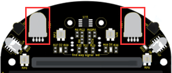

1.  **Description：**

The RGB color mode is a color standard in the industry. It obtains various
colors by changing the three color channels of red (R), green (G), and blue (B)
and integrating them. RGB denotes the three colors of red, green and blue.  
The monitors mostly adopt the RGB color standard, and all the colors on the
computer screen are composed of the three colors of red, green and blue mixed in
different proportions. A group of red, green and blue is the smallest display
unit. Any color on the screen can be recorded and expressed by a set of RGB
values.

Each of the three color channels of red, green, and blue is divided into 256
levels of brightness. At 0, the "light" is the weakest-it is turned off, and at
255, the "light" is the brightest. When the three-color gray values are the
same, the gray tones with different gray values are produced, that is, when the
three-color gray is 0, the darkest black is generated; when the three-color gray
is 255, it is the brightest white tone .

| Color                                     | RGB value（R,G,B） | Color code | Color    | RGB value（R,G,B） | Color code |
|-------------------------------------------|--------------------|------------|----------|--------------------|------------|
| Black                                     | 0,0,0              | \#000000   | Red      | 255,0,0            | \#FF0000   |
| Green                                     | 0,255,0            | \#00FF00   | Blue     | 0,0,255            | \#0000FF   |
| indigo                                    | 0,255,255          | \#00FFFF   | Dark red | 255,0,255          | \#FF00FF   |
| Yellow                                    | 255,255,0          | \#FFFF00   | White    | 255,255,255        | \#FFFFFF   |
| ......                                    | .......            | ......     | ......   | ......             | ......     |
| Adjust the numbers to get gradient colors |                    |            |          |                    |            |

RGB colors are called additive colors since the adding of R, G, and B together
(that is, all light reflect back to the eye) produces white color. Additive
colors are used for lighting, television and computer displays. For example,
displays produce color by emitting red, green, and blue rays. Most visible
spectra can be expressed as a mixture of red, green and blue (RGB) light in
different proportions and intensities. If these colors overlap, they produce
cyan, magenta and yellow.

We will make two experiments, one is that two RGB LEDs light up red, green,
blue, indigo, dark red, yellow and white color, another one is that RGB lights
display color in gradient way.

**1. What you need to get started**

(1) Insert micro:bit board into slot of V2 shield.

(2) Put batteries into battery holder

1.  Turn on the switch at the back of micro:bit car

2.  Link micro:bit board with computer via USB cable.

3.  Open the offline version of Mu

1.  **Test Code：**

**Code 1**

**RGB shows seven colors in loop way.**

Open“Code 1.py”file in Mu

（[How to load the project code?](#AS)）

| File Type   | Route                                | File Name          |
|-------------|--------------------------------------|--------------------|
| Python file | ../Python code/6.14：RGB Experiments | microbit-Code 1.py |

You can also input code in the editing window yourself.(Note:all English words
and symbols must be written in English)

**Import“keyes_Bit_Car_Driver.py“ File**

**Don’t click“Flash”immediately,** you need to firstly import
“keyes_Bit_Car_Driver.py”file which includes the control method of micro:bit
smart robot car, making Python code control robot car easily.

Files are mostly stored in the mu_code directory in your home directory. Mu’s
default directory is“Mu_code”.

Refer to the link: <https://codewith.mu/en/tutorials/1.0/files>

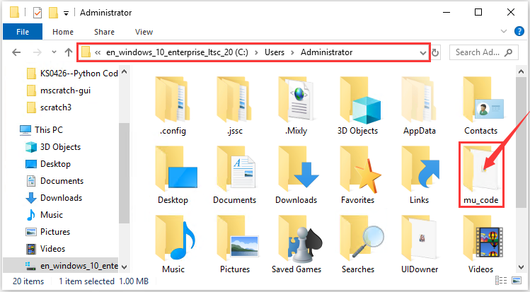

| File type    | Path                       | File name               |
|--------------|----------------------------|-------------------------|
| Python file  | .. /Python Code/ Libraries | keyes_Bit_Car_Driver.py |

Therefore, copy“keyes_Bit_Car_Driver.py“ to“mu_code”folder, as shown below:

Open Mu, connect micro:bit to computer, click“Files”and
drag“keyes_Bit_Car_Driver.py”library file to micro:bit.

You could view it in the left column, after importing “keyes_Bit_Car_Driver”file

Tap“Check”button to confirm if the code has errors. The program proves wrong if
there are underlines and cursors

Besides, the prompt signs will appear. The prompt is a warning sign which
doesn’t indicate wrong code.

If the code is correct, connect micro:bit to computer and click“Flash”to
download code to micro:bit board

Click“Flash”and appear errors, you need to confirm if you import
“keyes_Bit_Car_Driver.py”library.

Note: You need to import“keyes_Bit_Car_Driver.py”file to micro:bit.

If you program with different micro:bit, the library
file“keyes_Bit_Car_Driver.py”needs to be imported again to a new micro:bit

**Code 2：**

Display different colors

Open file“microbit- Code 2.py“ in Mu，

（[How to load the project code?](#AS)）

| File Type   | Route                                | File Name           |
|-------------|--------------------------------------|---------------------|
| Python file | ../Python code/6.14：RGB Experiments | microbit- Code 2.py |

You can also input code in the editing window yourself.(note:all English words
and symbols must be written in English)

Click“Files”to import“keyes_Bit_Car_Driver.py”library file to micro:bit

([How to import files?](#AW) ) . If micro:bit has library inside, you don’t need
add one.

Click“Check”to examine error in the code. The program proves wrong if underlines
and cursors are shown.

If the code is correct, connect micro:bit to computer and click“Flash”to
download code to micro:bit board

**4. Test Result：**

Download code 1 to micro:bit board and turn on the switch at the back of
micro:bit car, 2 RGB lights of smart car emit red, green, blue, indigo, dark
red, yellow and white color cyclically.

Download code 2 to micro:bit board and turn on the switch at the back of
micro:bit car, 2 RGB lights show different color in loop way.

**5. Code Explanation：**

| **from** microbit **import** \*                                                                                                                                                                                                                                                                          | import the library file of micro:bit                                                                                                                                                                                                                                                                                                 |
|----------------------------------------------------------------------------------------------------------------------------------------------------------------------------------------------------------------------------------------------------------------------------------------------------------|--------------------------------------------------------------------------------------------------------------------------------------------------------------------------------------------------------------------------------------------------------------------------------------------------------------------------------------|
| **from** keyes_Bit_Car_Driver  **import \***                                                                                                                                                                                                                                                             | Import the library file of keyes_Bit_Car_Driver                                                                                                                                                                                                                                                                                      |
| bitCar = Bit_Car_Driver()                                                                                                                                                                                                                                                                                |  instantiate                                                                                                                                                                                                                                                                                                                         |
| **while True:**                                                                                                                                                                                                                                                                                          | This is a permanent loop that makes micro:bit execute the code of it.                                                                                                                                                                                                                                                                |
| bitCar.headlights(255, 0, 0) sleep(1000) bitCar.headlights(0, 255, 0) sleep(1000) bitCar.headlights(0, 0, 255) sleep(1000) bitCar.headlights(0, 255, 255) sleep(1000) bitCar.headlights(255, 0, 255) sleep(1000) bitCar.headlights(255, 255, 0) sleep(1000) bitCar.headlights(255, 255, 255) sleep(1000) | 2 RGB LEDs light up red color Delay 1000ms 2 RGB LEDs light up green color Delay in 1000ms 2 RGB LEDs light up blue color Delay in1000ms 2 RGB light up indigo color Delay in1000ms 2 RGB LEDs light up dark red color Delay in1000ms 2 RGB LEDs light up yellow color Delay in1000ms 2 RGB LEDs light up white color Delay in1000ms |
| ledr = 0                                                                                                                                                                                                                                                                                                 | Set the initial value of ledr to 0                                                                                                                                                                                                                                                                                                   |
| ledg = 0                                                                                                                                                                                                                                                                                                 | Set the initial value of ledg to 0                                                                                                                                                                                                                                                                                                   |
| ledb = 0                                                                                                                                                                                                                                                                                                 | Set the initial value of ledb to 0                                                                                                                                                                                                                                                                                                   |
| **for** index **in** range(51):                                                                                                                                                                                                                                                                          | Repeat 51 times                                                                                                                                                                                                                                                                                                                      |
| bitCar.headlights(ledr, 0, 0)                                                                                                                                                                                                                                                                            | Set RGB lights of car: R：led-r G：0 B：0                                                                                                                                                                                                                                                                                            |
| bitCar.headlights(0, ledg, 0)                                                                                                                                                                                                                                                                            | Set RGB lights of car: R：0 G：ledg B：0                                                                                                                                                                                                                                                                                             |
| bitCar.headlights(0, 0, ledb)                                                                                                                                                                                                                                                                            | Set 2 RGB lights R：0 G: 0 B：ledb                                                                                                                                                                                                                                                                                                   |
| ledr += 5 ledr += -5 ledg += 5 ledg += -5 ledb += 5 ledb += -5                                                                                                                                                                                                                                           | Change the value of led-r by 5 Change the value of led-r by -5 Change the value of ledg by 5 Change the value of ledg by -5 Change the value of ledb by 5 Change the value of ledb by -5                                                                                                                                             |

## 6.15: KEYES-2812-18R Module

**1.Description：**

The KEYES-2812-18R module is fully compatible with micro:bit, in this lesson, we
make it display different colors through P5 end(D5 of shield) on micro:bit
board.

|                                                        | Name   | RGB（R,G,B）  | Code （16） |                                                 | Name   | RGB（R,G,B）  | Code （16） |
|--------------------------------------------------------|--------|---------------|-------------|-------------------------------------------------|--------|---------------|-------------|
|  | Red    | 255, 0, 0     | \#FF0000    |  | Orange | 255, 165, 0   | \#FFA500    |
|         | Yellow | 255, 255, 0   | \#FFFF00    |  | Green  | 0, 255, 0     | \#00FF00    |
|                                                        |        |               |             |                                                 |        |               |             |
|         | Blue   | 0, 255, 0     | \#0000FF    |  | indigo | 75, 0, 130    | \#4B0082    |
|         | violet | 238, 130, 238 | \#EE82EE    |  | purple | 160, 32, 240  | \#A020F0    |
|         | Black  | 0, 0, 0       | \#000000    |  | white  | 255, 255, 255 | \#FFFFFF    |
| ......                                                 | ...... | .......       | ......      | ......                                          | ...... | ......        | ......      |
| Alter tone of color to get different color             |        |               |             |                                                 |        |               |             |

**What you need to get started**

(1) Insert micro:bit board into slot of V2 shield.

(2) Put batteries into battery holder

(3) Turn on the switch at the back of micro:bit car

(4) Link micro:bit board with computer via USB cable.

(5) Open the offline version of Mu

**2. Test Code：**

**Code 1：**

Open“microbit-Code 1.py”file in Mu，（[How to load the project code?](#AS)）

| File Type   | Route                                      |
|-------------|--------------------------------------------|
| Python file | ../Python code/6.15：KEYES-2812-18R module |

You can also input code in the editing window yourself.(note:all English words
and symbols must be written in English)

Click“Check”to examine error in the code. The program proves wrong if underlines
and cursors are shown.

If the code is correct, connect micro:bit to computer and click“Flash”to
download code to micro:bit board

**Code 2：**

Open“microbit-Code 2.py”file in Mu（[How to load the project code?](#AS)）

| File Type   | Route                                       |
|-------------|---------------------------------------------|
| Python file | ../Python code/6.15：KEYES-2812-18R module/ |

You can also input code in the editing window yourself.(note:all English words
and symbols must be written in English)

Click“Check”to examine error in the code. The program proves wrong if underlines
and cursors are shown. 

If the code is correct, connect micro:bit to computer and click“Flash”to
download code to micro:bit board

**Code 3：**

Open“microbit-Code 3.py”file in Mu，（[How to load the project code?](#AS)）

| File Type   | Route                                       |
|-------------|---------------------------------------------|
| Python file | ../Python code/6.15：KEYES-2812-18R module/ |

You can also input code in the editing window yourself.(note:all English words
and symbols must be written in English)

Click“Check”to examine error in the code. The program proves wrong if underlines
and cursors are shown.

If the code is correct, connect micro:bit to computer and click“Flash”to
download code to micro:bit board

**Code 4：**

Open“microbit-Code 4.py” file，

（[How to load the project code?](#AS)）

| File Type   | Route                                       |
|-------------|---------------------------------------------|
| Python file | ../Python code/6.15：KEYES-2812-18R module/ |

You can also input code in the editing window yourself.(note:all English words
and symbols must be written in English)

Click“Check”to examine error in the code. The program proves wrong if underlines
and cursors are shown.

If the code is correct, connect micro:bit to computer and click“Flash”to
download code to micro:bit board.

**4.Test Result：**

Download code 1 to micro:bit, turn on the switch on robot car and every RGB on
KEYES-2812-18R module displays same color.

Download code 2 to micro:bit, turn on the switch on robot car, 18 pcs RGB on
KEYES-2812-18R light up and go off one by one.

Download code 3 to micro:bit, turn on the switch on robot car, every RGB light
on KEYES-2812-18R shows the same color and turns off one by one.

Download code 4 to micro:bit, turn on switch on robot car. Every RGB light on
KEYES-2812-18R lights up random color and goes off one by one.

**5.Code Explanation：**

| **from** microbit **import** \*                                                                                                                                                                                                                                             | import the library file of micro:bit                                                                                                                                                                                                                                                                                                           |
|-----------------------------------------------------------------------------------------------------------------------------------------------------------------------------------------------------------------------------------------------------------------------------|------------------------------------------------------------------------------------------------------------------------------------------------------------------------------------------------------------------------------------------------------------------------------------------------------------------------------------------------|
| **import** neopixel                                                                                                                                                                                                                                                         | Import the library file of neopixel                                                                                                                                                                                                                                                                                                            |
| np = neopixel.NeoPixel(pin5, 18)                                                                                                                                                                                                                                            | Initialize Neopixel  set Neopixel to initialize P5 with 18 LEDs                                                                                                                                                                                                                                                                                |
| np.clear()                                                                                                                                                                                                                                                                  | Turn off RGB on Neopixel strip                                                                                                                                                                                                                                                                                                                 |
| **while True:**                                                                                                                                                                                                                                                             | This is a permanent loop that makes micro:bit execute the code of it.This is a permanent loop, which makes micro:bit execute the code in this loop                                                                                                                                                                                             |
| **for** pixel_id1 **in** range(0, len(np)):                                                                                                                                                                                                                                 | Set RGB to pixel_id1 in the range of （0，len（np））                                                                                                                                                                                                                                                                                          |
| **for** index **in** range(0, 18):                                                                                                                                                                                                                                          | Set the pixel of RGB to index in the range of（0，18）                                                                                                                                                                                                                                                                                         |
| np.show()                                                                                                                                                                                                                                                                   | Show the current pixel on Neopixel strip                                                                                                                                                                                                                                                                                                       |
| np[pixel_id1] = (255, 0, 0) np[pixel_id2] = (255, 165, 0) np[pixel_id3] = (255, 255, 0) np[pixel_id4] = (0, 255, 0) np[pixel_id5] = (0, 0, 255) np[pixel_id6] = (75, 0, 130) np[pixel_id7] = (238, 130, 238) np[pixel_id8] = (160, 32, 240) np[pixel_id9] = (255, 255, 255) | Set pixel_id1 to display red color Set pixel_id2 to display orange color Set pixel_id3 to display yellow color Set pixel_id4 to display green color Set pixel_id5 to display blue color Set pixel_id6 to display indigo color Set pixel_id7 to display violet color Set pixel_id8 to display purple color Set pixel_id9 to display white color |
| **from** random **import** randint                                                                                                                                                                                                                                          | Import randint from random variables                                                                                                                                                                                                                                                                                                           |
| flag = 1                                                                                                                                                                                                                                                                    | Set the initial value of flag to 1                                                                                                                                                                                                                                                                                                             |
| red = 255 green = 0 blue = 0                                                                                                                                                                                                                                                | Set the initial value of variable red to 255 Set the initial value of variable green to 0 Set the initial value of variable blue to 0                                                                                                                                                                                                          |
| **while** flag == 1:                                                                                                                                                                                                                                                        | When flag=1                                                                                                                                                                                                                                                                                                                                    |
| red = red - 35 green = green + 35 blue = blue + 35                                                                                                                                                                                                                          | Variable red reduces 35 gradually Variable green adds 35 gradually Variable blue adds 35 gradually                                                                                                                                                                                                                                             |
| **if** red \<= 0: red = 0 **if** green \>= 255: green = 255 **if** blue \>= 255: blue = 255                                                                                                                                                                                 | If variable red≤0 Variable red=0 If Variable green≥255 Variable green=255 If Variable blue≥255 Variable blue=255                                                                                                                                                                                                                               |
| np[pixel_id] = (red, green, blue)                                                                                                                                                                                                                                           | Set pixel_id to flash colorful light on Neopixel strip                                                                                                                                                                                                                                                                                         |
| **for** pixel_close **in** range(0, len(np)):                                                                                                                                                                                                                               | Pixel of RGB is pixel_close in the range of（0，len（np））                                                                                                                                                                                                                                                                                    |
| np[pixel_close] = (0, 0, 0)                                                                                                                                                                                                                                                 | Set RGB on Neopixel strip to light off                                                                                                                                                                                                                                                                                                         |
| R = 0 G = 0 B = 0                                                                                                                                                                                                                                                           | Set the initial value of R to 0 Set the initial value of G to 0 Set the initial value of B to 0                                                                                                                                                                                                                                                |
| R = randint(10, 255) G = randint(10, 255) B = randint(10, 255)                                                                                                                                                                                                              | Set R=randint(10, 255) Set G=randint(10, 255) Set B=randint(10, 255)                                                                                                                                                                                                                                                                           |

## 6.16: Photoresistor

1.  **Description：**

The photocell sensor (photoresistor) is a resistor made by the photoelectric
effect of a semiconductor. It is very sensitive to ambient light, thus its
resistance value vary with different light intensity.

We use its features to design a circuit and generate a photoresistor sensor
module. The signal end of the module is connected to the analog port of the
microcontroller. When the light intensity increases, the resistance decreases,
and the voltage of the analog port rises, that is, the analog value of the
microcontroller also goes up. Otherwise, when the light intensity decreases, the
resistance increases, and the voltage of the analog port declines. That is, the
analog value of the microcontroller becomes smaller. Therefore, we can use the
photoresistor sensor module to read the corresponding analog value and sense the
light intensity in the environment.

It is commonly applied to light measurement, control and conversion, light
control circuit as well.

The smart robot car comes with photoresistor. In the experiment, we control 18
RGB lights by photoresistor. The darker the ambient environment, the lighter the
RGB.

**What you need to get started**

(1) Insert micro:bit board into slot of V2 shield.

(2) Put batteries into battery holder

(3) Turn on the switch at the back of micro:bit car

(4) Link micro:bit board with computer using USB cable.

(5) Open the offline version of Mu

1.  **Test Code：**

**Code 1：**

Detect light intensity through photoresistor

Open“microbit-Code 1.py“ in Mu，

（[How to load the project code?](#AS)）

| File Type   | Route                                | File Name          |
|-------------|--------------------------------------|--------------------|
| Python file | ../Python code/6.16：Photoresistor / | microbit-Code 1.py |

You can also input code in the editing window yourself.(note:all English words
and symbols must be written in English)

Click“Check”to examine error in the code. The program proves wrong if underlines
and cursors are shown.

If the code is correct, connect micro:bit to computer and click“Flash”to
download code to micro:bit board

Download code 1 to micro:bit and plug micro:bit into power. Click**“REPL” button
and press reset button on micro:bit board.** BBC microbit REPL shows the
intensity value. The value varies with the external light intensity. The weaker
the light intensity is, the smaller the value is. As shown below:

**Code 2：**

Open“microbit-Code 2.py”file in Mu，

（[How to load the project code?](#AS)）

| File Type   | Route                              | File Name          |
|-------------|------------------------------------|--------------------|
| Python file | ../Python code/6.16：Photoresistor | microbit-Code 2.py |

You can also input code in the editing window yourself.(note:all English words
and symbols must be written in English)

Click“Check”to examine error in the code. The program proves wrong if underlines
and cursors are shown.

If the code is correct, connect micro:bit to computer and click“Flash”to
download code to micro:bit board

**4. Test Result：**

Download code2 to micro:bit, turn on the switch on robot car, then
KEYES-2812-18R module shows white color. The weaker the light intensity is, the
brighter the KEYES-2812-18R gets.

**5. Code Explanation：**

| **from** microbit **import** \*                     | import the library file of micro:bit                                       |
|-----------------------------------------------------|----------------------------------------------------------------------------|
| **import** neopixel                                 | Import the library file of neopixel                                        |
| np = neopixel.NeoPixel(pin5, 18)                    | Initialize Neopixel                                                        |
| np.clear()                                          | RGB goes off                                                               |
| **while True:**                                     | This is a permanent loop that makes micro:bit execute the code of it.      |
| val1 = pin1.read_analog()                           | Set the light intensity value of photoresistor of P1 to val                |
| val2 = int((val1/1023)\*255)                        | Set int((val1/1023)\*255) to val2                                          |
| **for** pixel_id **in** range(0, len(np)):          | Set the pixel of RGB to pixel_id in the range of（0，len（np））           |
| np[pixel_id] = (255 - val2, 255 - val2, 255 - val2) | Set the color of pixel_id to RGB（red 255-val green 255-val blue 255-val） |
| np.show()                                           | Display the current pixel_id on Neopixel strip                             |
| sleep(100)                                          | Delay in 100ms                                                             |

1.  **Reference：**

read_analog() : read the voltage of pin, and more details please refer to
[https://microbit-micropython.readthedocs.io/en/latest/pin.html](https://microbit-micropython.readthedocs.io/en/latest/pin.html%20)

## 6.17: Motor Driving

1.  **Description：**

Keyestudio Micro：bit robot car is equipped with two DC geared motors.

DC geared motor is integration of reducer and motor, which is widely applied to
steel and machinery industry.

The shield of smart car is inclusive of PCA9685PW and TB6612FNG chip.

In order to save the resources of IO ports, we control the rotation speed and
direction by TB6612FNG chip.

**What you need to get started**

1.  Insert micro:bit board into slot of V2 shield.

2.  Put batteries into battery holder

3.  Turn on the switch at the back of micro:bit car

4.  Link micro:bit board with computer via USB cable.

5.  Open the offline version of Mu

1.  **Test Code：**

**Code 1：**

**CarRun**

Open“microbit-Code 1.py” file in Mu，

（[How to load the project code?](#AS)）

| File Type   | Route                              | File Name          |
|-------------|------------------------------------|--------------------|
| Python file | ../Python code/6.17：Motor Driving | microbit-Code 1.py |

You can also input code in the editing window yourself.(note:all English words
and symbols must be written in English)

Click“Files”to import the library file of“keyes_Bit_Car_Driver.py”to micro:bit
([How to import files?](#AW) )

If micro:bit has library, you don’t need to add one.

Click“Check”to examine error in the code. The program proves wrong if underlines
and cursors are shown.

If the code is correct, connect micro:bit to computer and click“Flash”to
download code to micro:bit board.

**Code 2：**

Open“microbit-Code 2.py”file in Mu.

（[How to load the project code?](#AS)）

| File Type   | Route                              | File Name                   |
|-------------|------------------------------------|-----------------------------|
| Python file | ../Python code/6.17: Motor Driving | microbit-Motor Driving-2.py |

You can also input code in the editing window yourself.(note:all English words
and symbols must be written in English)

**Note: Download code 2 to micro:bit, and turn on the switch of micro:bit.
(Note: the control pin of right obstacle avoidance sensor and B button are P11.
To prevent the obstacle avoidance sensor from interfering button B, we could
screw the potentiometer RP9 clockwise to turn off the right obstacle sensor.**

Click“Files”to import the library of“keyes_Bit_Car_Driver.py“ to micro:bit.

([How to import files?](#AW) )

Click“Check”to examine error in the code. The program will be wrong if
underlines and cursors are shown.

If the code is correct, connect micro:bit to computer and click“Flash”to
download code to micro:bit board

**4.Test Result：**

Download code 1 to micro:bit, and turn on the switch on robot car. The robot car
will go forward for 1s, back for 1s, turn left for 1s, right for 1s, turn
anticlockwise for 1s, clockwise for 1 and stop 1s. Matrix also displays the
patterns.

**Note: Download code 2 to micro:bit, and turn on the switch of micro:bit.
(Note: the control pin of right obstacle avoidance sensor and B button are P11.
To prevent the obstacle avoidance sensor from interfering button B, we could
screw the potentiometer RP9 clockwise to turn off the right obstacle sensor.**

When the button A and B are firstly pressed, micro:bit will show“L”, the route
of car is“L”. When they are pressed again,“口”is shown on micro:bit, and route
of car is“口”.

**5. Code Explanation：**

| **from** microbit **import** \*                                                                                                                                                                                               | import the library file of micro:bit                                                                                                                                                                            |
|-------------------------------------------------------------------------------------------------------------------------------------------------------------------------------------------------------------------------------|-----------------------------------------------------------------------------------------------------------------------------------------------------------------------------------------------------------------|
| **from** keyes_Bit_Car_Driver  **import \***                                                                                                                                                                                  | Import the library of keyes_Bit_Car_Driver                                                                                                                                                                      |
| bitCar = Bit_Car_Driver()                                                                                                                                                                                                     | Set Bit_Car_Driver() to bitCar                                                                                                                                                                                  |
| **while True:**                                                                                                                                                                                                               | This is permanant loop, and make micro:bit excute the codeThis is a permanent loop that makes micro:bit execute the code of it.                                                                                 |
| display.show(Image.ARROW_S) display.show(Image.ARROW_N) display.show(Image.ARROW_E) display.show(Image.ARROW_W) display.show(Image("00900:""09990:""99999:""99999:""09090"))                                                  | micro:bit shows arrow pointing to South micro:bit shows arrow pointing to North micro:bit shows arrow pointing to East micro:bit shows arrow pointing to West micro:bit displays“❤”                             |
| bitCar.motorL(1, 200) bitCar.motorR(1, 200)                                                                                                                                                                                   | The left motor of car rotates clockwise at the speed of PWM200 （1: clockwise，0: anticlockwise；PWM100 means speed（0\~255）） The right motor of car rotates clockwise at the speed of PWM200                 |
| bitCar.motorL(0, 200) bitCar.motorR(0, 200)                                                                                                                                                                                   | The left motor of car rotates anticlockwise at the speed of PWM200 The right motor of car rotates anticlockwise at the speed of PWM200                                                                          |
| sleep(1000)                                                                                                                                                                                                                   | Delay in 1000ms                                                                                                                                                                                                 |
| a = 0 b = 0                                                                                                                                                                                                                   | Set the initial value of a to 0 Set the initial value of b to 0                                                                                                                                                 |
| **def** run_L(): **def** run_O():                                                                                                                                                                                             | Define subroutine run_L()                                                                                                                                                                                       |
| show_L = Image("90000:""90000:""90000:""90000:""99999")                                                                                                                                                                       | Set show_L=Image()                                                                                                                                                                                              |
| **if** button_a.was_pressed(): a = a + 1 **if** a \>= 3: a = 0 **if** button_b.was_pressed(): b = 1 **if** (a == 1): display.show(show_L) **if** b == 1: run_L() **elif** a == 2: display.show(show_O) **if** b == 1: run_O() | If button A is pressed, a = a + 1 If a≥3 a=0 If button B is pressed, b=1 If a=1 micro:bit shows“L”pattern If b=1 The track of car is route L  If a=2 micro:bit shows“O”image If b=1 The track of car is route O |

## 6.18: Line Tracking Car

6.18.1: Line Tracking Sensor

1.  **Description：**

The V2 expansion board of Keyestudio Micro:bit mini smart robot car comes with
two line tracking elements which adopt TCRT5000 IR tubes.

TCRT5000 IR tube has an IR emitting tube and a receiving tube.

Low level(0) is output when IR transmitting tube emits IR signals to receiving
tube; high level(1) will be output when smart car runs along black line.

**What you need to get started**

(1) Insert micro:bit board into slot of V2 shield.

(2) Put batteries into battery holder

(3) Turn on the switch at the back of micro:bit car

(4) Link micro:bit board with computer via USB cable.

(5) Open the offline version of Mu

1.  **Test Code：**

**Code 1：**

Open the file“Code 1.py”in Mu（[How to load the project code?](#AS)）

| File Type   | Route                                         | File Name |
|-------------|-----------------------------------------------|-----------|
| Python file | ../Python code/6.18：Line tracking car/6.18.1 | Code 1.py |

You can also input code in the editing window yourself.(Note:all English words
and symbols must be written in English)

Click“Check”to examine error in the code. The program proves wrong if underlines
and cursors are shown. 

If the code is correct, connect micro:bit to computer and click“Flash”to
download code to micro:bit board.

Download code 1 onto micro:bit board, don’t plug off USB cable. Click“REPL”and
press the reset buttons, the readings detected by right line tracking sensor are
displayed on monitor.

When the right line tracking sensor detects white object, 0 will be shown and D6
will be on; when no white objects and only black object are detected, 1 will be
displayed and D6 will be off, as shown below.

**Code 2：**

Open file“Code 2.py in Mu.（[How to load the project code?](#AS)）

| File Type   | Route                                          | File Name           |
|-------------|------------------------------------------------|---------------------|
| Python file | ../Python code/ 6.18：Line tracking car/6.18.2 | microbit-Code 2 .py |

You can also input code in the editing window yourself.(note:all English words
and symbols must be written in English)

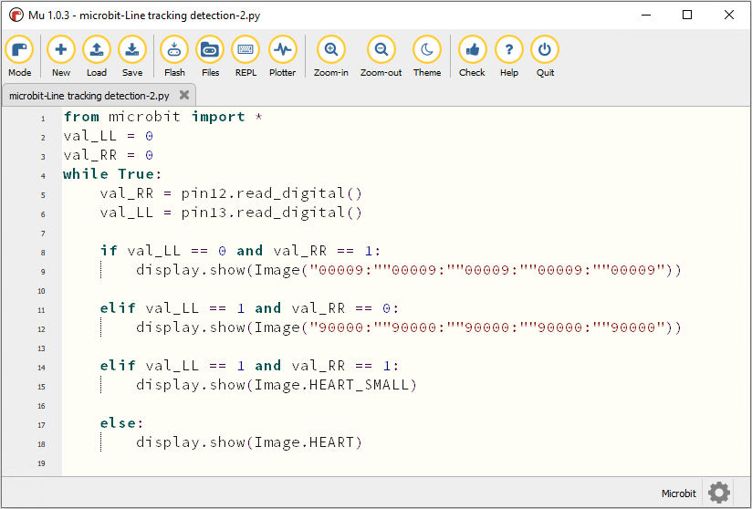

Click“Check”to examine error in the code. The program proves wrong if underlines
and cursors are shown.

If the code is correct, connect micro:bit to computer and click“Flash”to
download code to micro:bit board.

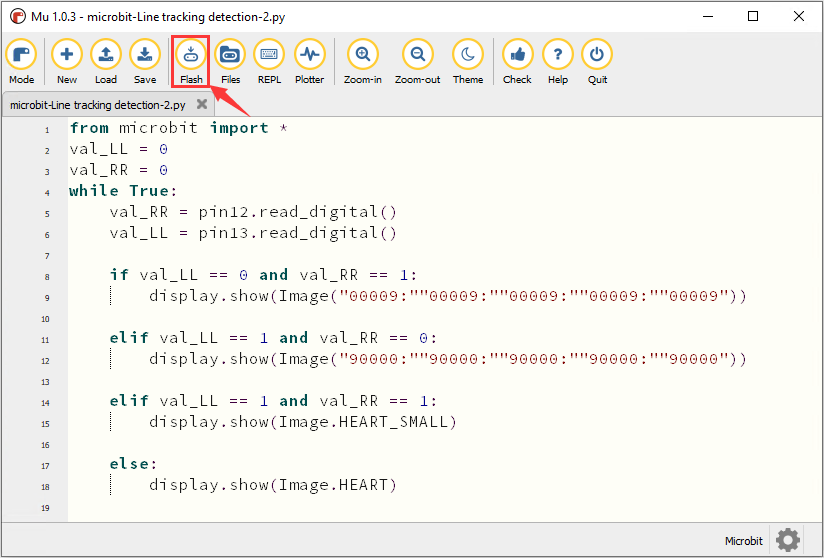

**4.Test Result：**

Download code 2 to micro:bit, turn on the switch on robot car. When white object
is detected by left sensor, micro bit shows“I”pattern at its left and D2 is on.

When only right sensor detects the white object, micro bit shows“I”pattern at
its right and D6 is on.

If both of line tracking sensors detect black object or no object is detected,
“”will be shown on micro:bit.

If both detect white object,“❤”will be shown and D2 and D6 will be on.

**5.Code Explanation：**

| **from** microbit **import** \*                                                                                                                                                                                                                                                                                           | import the library file of micro:bit                                                                                                                                                                                                                                                      |
|---------------------------------------------------------------------------------------------------------------------------------------------------------------------------------------------------------------------------------------------------------------------------------------------------------------------------|-------------------------------------------------------------------------------------------------------------------------------------------------------------------------------------------------------------------------------------------------------------------------------------------|
| val_RR = 0                                                                                                                                                                                                                                                                                                                | Set the initial value of val_RR to 0                                                                                                                                                                                                                                                      |
| val_LL = 0                                                                                                                                                                                                                                                                                                                | Set the initial value of val_LL to 0                                                                                                                                                                                                                                                      |
| **while True:**                                                                                                                                                                                                                                                                                                           | This is a permanent loop that makes micro:bit execute the code of it.                                                                                                                                                                                                                     |
| val_RR = pin12.read_digital()                                                                                                                                                                                                                                                                                             | Set the digital signal read by tracking sensor connected to pin12, to val_RR                                                                                                                                                                                                              |
| val_LL = pin13.read_digital()                                                                                                                                                                                                                                                                                             | Set the digital signal read by tracking sensor connected to pin13, to val_LL                                                                                                                                                                                                              |
| print("Light intensity:", Lightintensity)                                                                                                                                                                                                                                                                                 | BBC microbit REPL prints the digital signals read by line tracking sensor                                                                                                                                                                                                                 |
| sleep(100)                                                                                                                                                                                                                                                                                                                | Delay in 100ms                                                                                                                                                                                                                                                                            |
| **if** val_LL == 0 **and** val_RR == 1: display.show(Image("00009:""00009:""00009:""00009:""00009")) **elif** val_LL == 1 **and** val_RR == 0: display.show(Image("90000:""90000:""90000:""90000:""90000")) **elif** val_LL == 1 **and** val_RR == 1: display.show(Image.HEART_SMALL) **else:** display.show(Image.HEART) | When val_LL = 0 and val_RR = 1 micro:bit shows“1”on the left When val_LL = 1 and val_RR = 0 micro:bit shows “1”on the right When val_LL =1 and val_RR = 1micro:bit displays“”. If the above conditions are not met, micro:bit displays“❤”. |

6.18.2: Line Tracking Car

**1. Description：**

In this lesson we will combine line tacking sensors with motor to make a line
tracking smart car.

The micro:bit board will analyze the signals and control smart car to show line
tracking function.

If two line tracking sensors detect black line, the smart car will go
forward；if only left sensor detects black line, robot car will turn left; if
only right sensor detects black line，smart car will turn right；if black line
is not detected, car will stop.

**2. What you need to get started**

1.  Insert micro:bit board into slot of V2 shield.

2.  Put batteries into battery holder

3.  Turn on the switch at the back of micro:bit car

4.  Link micro:bit board with computer via USB cable.

5.  Open the offline version of Mu

| Left/Right line tracking sensor（Level） | Line tracking Smart Car |            |
|------------------------------------------|-------------------------|------------|
| Low（0）                                 | High（1）               | Turn right |
| High（1）                                | Low（0）                | Go back    |
| High（1）                                | High（1）               | Go forward |
| Low（0）                                 | Low（0）                | Stop       |

1.  **Flow Chart**

1.  **Test Code：**

Open“microbit- Line Tracking Car.py“ in Mu：（[How to load the project
code?](#AS)）

| File Type   | Route                                         | File Name                      |
|-------------|-----------------------------------------------|--------------------------------|
| Python file | ../Python Code/6.18：Line tracking car/6.18.2 | microbit- Line Tracking Car.py |

You can also input code in the editing window yourself.(note: all English words
and symbols must be written in English)

Click“Files”to import the library file of“keyes_Bit_Car_Driver.py to micro:bit
([How to import files?](#AW) )

If micro:bit has library, you don’t need to add one.

Click“Check”to examine error in the code. The program proves wrong if underlines
and cursors are shown.

If the code is correct, connect micro:bit to computer and click“Flash”to
download code to micro:bit board

1.  **Test Result：**

Download code to micro:bit and turn on the switch at the back of micro:bit car.
The car can follow black traces and KEYES-2812-18R module lights up.

**Note: (1) the width of black trace should be wider than the distance between
two line tracking sensors.**

**Avoid to test smart car under the strong light.**

1.  **Code Explanation：**

| **from** keyes_Bit_Car_Driver  **import \***                                                                                                                                                                                                                                                          | Import the library file of keyes_Bit_Car_Driver                                                                                                                                                                                                                                                                                                                                                                                                                                                                                                                                  |
|-------------------------------------------------------------------------------------------------------------------------------------------------------------------------------------------------------------------------------------------------------------------------------------------------------|----------------------------------------------------------------------------------------------------------------------------------------------------------------------------------------------------------------------------------------------------------------------------------------------------------------------------------------------------------------------------------------------------------------------------------------------------------------------------------------------------------------------------------------------------------------------------------|
| **import** neopixel                                                                                                                                                                                                                                                                                   | Import the library file of neopixel                                                                                                                                                                                                                                                                                                                                                                                                                                                                                                                                              |
| bitCar = Bit_Car_Driver()                                                                                                                                                                                                                                                                             | Set Bit_Car_Driver() to bitCar                                                                                                                                                                                                                                                                                                                                                                                                                                                                                                                                                   |
| np = neopixel.NeoPixel(pin5, 18)                                                                                                                                                                                                                                                                      | Initialize Neopixel                                                                                                                                                                                                                                                                                                                                                                                                                                                                                                                                                              |
| display.show(Image.HAPPY)                                                                                                                                                                                                                                                                             | micro:bit shows the smile pattern                                                                                                                                                                                                                                                                                                                                                                                                                                                                                                                                                |
| **while True:**                                                                                                                                                                                                                                                                                       | This is a permanent loop that makes micro:bit execute the code of it.                                                                                                                                                                                                                                                                                                                                                                                                                                                                                                            |
| val_RR = pin12.read_digital()                                                                                                                                                                                                                                                                         | Set the digital signal read by line tracking sensor connected to P12, to val_RR                                                                                                                                                                                                                                                                                                                                                                                                                                                                                                  |
| val_LL = pin13.read_digital()                                                                                                                                                                                                                                                                         | Set the digital signal read by line tracking sensor connected P13, to val_LL                                                                                                                                                                                                                                                                                                                                                                                                                                                                                                     |
| **for** pixel_id1 in range(0, len(np)): np[pixel_id1] = (255, 100, 100) np.show()                                                                                                                                                                                                                     | Set the pixel of RGB to pixel_id1 in the range of （0，len（np））  Set the pixel of RGB on Neopixel strip to pixel_id1 on (255, 100, 100)  Display pixel on Neopixel strip                                                                                                                                                                                                                                                                                                                                                                                                      |
| **if** val_LL == 0 **and** val_RR == 1:  bitCar.motorL(1, 80) bitCar.motorR(0, 30) **elif** val_LL == 1 and val_RR == 0:  bitCar.motorL(0, 30) bitCar.motorR(1, 80) **elif** val_LL == 1 and val_RR == 1: bitCar.motorL(1, 60) bitCar.motorR(1, 60) **else:** bitCar.motorL(0, 0) bitCar.motorR(0, 0) | If val_LL = 0 and val_RR = 1 Left motor rotates clockwise at thes peed of PWM 80（1: clockwise，0: anticlockwise；speed: PWM 80（0\~255）） Right motor rotates anticlockwise at the speed of PWM 30 When val_LL =1 and val_RR = 0 Left motor rotates anticlockwise at the speed of PWM 30 Right motor rotates clockwise at the speed of PWM 80 When val_LL = 1 and val_RR = 1 Left motor rotates clockwise at the speed of PWM 60 Right motor rotates clockwise at the speed of PWM 60 If the above conditions are not met Left motor doesn’t rotate Right motor doesn’t rotate |

## 6.19: Ultrasonic Follow Smart Car

6.19.1: Ultrasonic Ranging

**1. Description：**

The HC-SR04 ultrasonic sensor uses sonar to determine distance to an object like
bats do. It offers excellent non-contact range detection with high accuracy and
stable readings in an easy-to-use package. It comes complete with ultrasonic
transmitter and receiver modules.

The HC-SR04 or the ultrasonic sensor is being used in a wide range of
electronics projects for creating obstacle detection and distance measuring
application as well as various other applications.

As the above picture shown, it is like two eyes. One is transmitting end, the
other is receiving end.

The ultrasonic module will emit the ultrasonic waves after trigger signal. When
the ultrasonic waves encounter the object and are reflected back, the module
outputs an echo signal, so it can determine the distance of object from the time
difference between trigger signal and echo signal.

**2. Working principle ：**

1.  Pull down TRIG then trigger high level signals with least 10us.

2.  After triggering, the module will automatically send eight 40KHz ultrasonic
    pulses and detect whether there is a signal return.

3.  The propagation speed of sound in the air is about 343m/s, therefore,
    distance = speed \* time, because the ultrasonic wave emits and comes back,
    which is 2 times of distance, so it needs to be divided by 2, the distance
    measured by ultrasonic wave = (speed \* time)/2

**3. Specification：**

-   Working voltage：3-5.5V（DC）

-   Power Supply :+5V DC

-   Working Current: 15mA

-   Working frequency: 40khz

-   Maximum Ranging Distance : around 3m

-   Minimum Ranging Distance: 2-3cm

-   Resolution : 0.3 cm

-   Measuring Angle: ≤15 degree

-   Trigger Input Pulse width: 10uS

-   Accuracy: up to 0.2cm

-   Output echo signal : output TTL level signal(high), which is proportion to
    range.

1.  **What you need to get started**

2.  Insert micro:bit board into slot of V2 shield.

3.  Put batteries into battery holder

4.  Turn on the switch at the back of micro:bit car

5.  Link micro:bit board with computer via USB cable.

6.  Open the offline version of Mu

1.  **Test Code：**

Open “6.19.1- Ultrasonic Ranging.py”file in Mu software

（[How to load the project code?](#AS)）

| File Type   | Route                                            | File Name                     |
|-------------|--------------------------------------------------|-------------------------------|
| Python file | ../Python code/6.19：Ultrasonic Follow Smart car | 6.19.1- Ultrasonic Ranging.py |

You can also input code in the editing window yourself.(note:all English words
and symbols must be written in English)

Click“Files”to import the library file of“keyes_Bit_Car_Driver.py to micro:bit
([How to import files?](#AW) )

If micro:bit has library, you don’t need to add one.

Click“Check”to examine error in the code. The program proves wrong if underlines
and cursors are shown.

**Make sure code correct, connect micro:bit to computer via USB cable, turn on
the switch of keyestudio Micro:bit robot car and click“Flash”to download code to
micro:bit.**

**6. Test Result：**

After downloading code, keep USB cable connected, click**“REPL”button and press
the reset button.** REPL window shows the distance value between the ultrasonic
sensor and the obstacle(as shown below), when the distance between obstacle and
ultrasonic sensor is less than 10cm, the passive buzzer emits sound.

**7. Code Explanation：**

| **from** microbit **import \***                         | import the library file of microbit                                                              |
|---------------------------------------------------------|--------------------------------------------------------------------------------------------------|
| **from** keyes_Bit_Car_Driver **import \***             | import the library file of keyes_Bit_Car_Driver                                                  |
| bitCar = Bit_Car_Driver()                               |  instantiate                                                                                     |
| **import** music                                        | import the library file of music                                                                 |
| tune = ["C4:4"]                                         | Create variable tune to save notes                                                               |
| **while True:**                                         | This is a permanent loop that makes micro:bit execute the code of it.                            |
| i = 0                                                   | Set variable i=0                                                                                 |
| distance = bitCar.get_distance()                        | Set bitCar.get_distance() to distance                                                            |
| print("distance:", distance)                            | BBC microbit REPL window shows the distance value between the ultrasonic sensor and the obstacle |
| **if** distance \< 10:                                  | **if** distance \< 10                                                                            |
| **while** i \< 1:                                       | When i＜1                                                                                        |
| music.play(tune) sleep(200) music.play(tune) sleep(200) |  Passive buzzer emits “tick,tick”                                                                |
| i += 1                                                  | Variable i plus 1                                                                                |

6.19.2: Ultrasonic Follow Smart Car

**1. Description：**

In previous lesson, we’ve learned the basic principle of line tracking sensor.
Next, we will combine ultrasonic sensor with car shield to make an ultrasonic
follow car.

**What you need to get started**

1.  Insert micro:bit board into slot of V2 shield.

2.  Put batteries into battery holder

3.  Dial POWER switch to ON end on shield.

4.  Link micro:bit board with computer via USB cable.

5.  Open the offline version of Mu

**3. Flow Chart**

1.  **Test Code：**

Open“6.19.2-Ultrasonic Follow Smart Car.py”file in Mu,（[How to load the project
code?](#AS)）

| File Type   | Route                                         | File Name                             |
|-------------|-----------------------------------------------|---------------------------------------|
| Python file | ../Python code/6.19：Ultrasonic following car | 6.19.2-Ultrasonic Follow Smart Car.py |

You can also input code in the editing window yourself.(note:all English words
and symbols must be written in English)

Click“Files”to import the library file of“keyes_Bit_Car_Driver.py”to micro:bit
([How to import files?](#AW) )

If micro:bit has library, you don’t need to add one.

Click“Check”to examine error in the code. The program proves wrong if underlines
and cursors are shown.

**Make sure code correct, connect micro:bit to computer via USB cable, turn on
the switch of keyestudio Micro:bit robot car and click“Flash”to download code to
micro:bit board.**

**5.Test Result：**

After downloading code, turn on the switch of robot car, as a result, the car
will follow the obstacle to move and KEYES-2812-18R module will display
different colors.

**6.Code Explanation：**

| **from** keyes_Bit_Car_Driver **import \***                                                                                                                                                                                                                                                                                                                                                                                                                                                                                           | Import the library file of keyes_Bit_Car_Driver                                                                                                                                                                                                                                                                                                                                                                                                                                                                                                                                                                                                                                                                                                                      |
|---------------------------------------------------------------------------------------------------------------------------------------------------------------------------------------------------------------------------------------------------------------------------------------------------------------------------------------------------------------------------------------------------------------------------------------------------------------------------------------------------------------------------------------|----------------------------------------------------------------------------------------------------------------------------------------------------------------------------------------------------------------------------------------------------------------------------------------------------------------------------------------------------------------------------------------------------------------------------------------------------------------------------------------------------------------------------------------------------------------------------------------------------------------------------------------------------------------------------------------------------------------------------------------------------------------------|
| bitCar = Bit_Car_Driver()                                                                                                                                                                                                                                                                                                                                                                                                                                                                                                             |  instantiate                                                                                                                                                                                                                                                                                                                                                                                                                                                                                                                                                                                                                                                                                                                                                         |
| **import** neopixel                                                                                                                                                                                                                                                                                                                                                                                                                                                                                                                   | Import the library file of neopixel                                                                                                                                                                                                                                                                                                                                                                                                                                                                                                                                                                                                                                                                                                                                  |
| np = neopixel.NeoPixel(pin5, 18)                                                                                                                                                                                                                                                                                                                                                                                                                                                                                                      | Initialize Neopixel                                                                                                                                                                                                                                                                                                                                                                                                                                                                                                                                                                                                                                                                                                                                                  |
| **from** random **import** randint                                                                                                                                                                                                                                                                                                                                                                                                                                                                                                    | Import randint from random variables                                                                                                                                                                                                                                                                                                                                                                                                                                                                                                                                                                                                                                                                                                                                 |
| **while True:**                                                                                                                                                                                                                                                                                                                                                                                                                                                                                                                       | This is a permanent loop that makes micro:bit execute the code of it.                                                                                                                                                                                                                                                                                                                                                                                                                                                                                                                                                                                                                                                                                                |
| distance = 0                                                                                                                                                                                                                                                                                                                                                                                                                                                                                                                          | Set the initial value of distance to 0                                                                                                                                                                                                                                                                                                                                                                                                                                                                                                                                                                                                                                                                                                                               |
| distance = bitCar.get_distance()                                                                                                                                                                                                                                                                                                                                                                                                                                                                                                      | Set distance = bitCar.get_distance()                                                                                                                                                                                                                                                                                                                                                                                                                                                                                                                                                                                                                                                                                                                                 |
| **if** distance \>= 10 **and** distance \<= 30: bitCar.motorL(1, 100) bitCar.motorR(1, 100) **for** pixel_id1 **in** range(0, len(np)): np[pixel_id1] = (255, 0, 0) np.show() **if** distance \<= 6: bitCar.motorL(0, 100) bitCar.motorR(0, 100) **for** pixel_id1 **in** range(0, len(np)): np[pixel_id1] = (255, 255, 0) np.show() **if** distance \> 6 **and** distance \< 10 **or** distance \> 30: bitCar.motorL(0, 0) bitCar.motorR(0, 0) **for** pixel_id1 **in** range(0, len(np)): np[pixel_id1] = (255, 255, 255) np.show() | If distance ≥10 and distance ≤ 30 Left motor rotates clockwise at the speed of PWM100 Right motor rotates clockwise at the speed of PWM100 RGB pixel is pixel_id1 in the range of （0，len（np）） Set pixel_id1 to light up red color Display pixel on Neopixel strip If distance ≤6 Left motor rotates anticlockwise at the speed of PWM100 Right motor rotates anticlockwise at the speed of PWM100 RGB pixel is pixel_id1 in the range of （0，len（np）） Set pixel_id1to light up yellow color Display pixel on Neopixel strip If distance＞6, distance＜10 or distance＞30 left motor doesn’t rotate right motor doesn’t rotate RGB pixel is pixel_id1 in the range of （0，len（np）） Set pixel_id1 to light up white color Display pixel on Neopixel strip |

## 6.20: Obstacle Avoidance and Follow Smart Car

6.20.1: Obstacle Avoidance Function

1.  **Description：**

The shield of smart car comes with two IR obstacle avoidance sensors which adopt
transmitting tube and receiving tube.

The IR rays will reflect back to receiving tube if there is an obstacle. Next,
sensor will determine the obstacle and send test result to microcontroller.

After a series of processing analysis, the smart car will avoid the obstacle.

The low level (0) will be output when the obstacle is detected, otherwise, the
high level(1) will be output

IR obstacle avoidance sensor is generally applied to obstacle avoiding, line
tracking, anti-falling, counter and production line cutting and liquid level
detection, etc

**What you need to get started**

1.  Insert micro:bit board into slot of V2 shield.

2.  Put batteries into battery holder

3.  Turn on the switch at the back of micro:bit car

4.  Link micro:bit board with computer via USB cable.

5.  Open the offline version of Mu

**3. Test Code：**

**Code 1：**

Open file“Code 1.py“ in Mu，

（[How to load the project code?](#AS)）

| File Type   | Route                                                           | File Name |
|-------------|-----------------------------------------------------------------|-----------|
| Python file | ../Python code/6.20：Obstacle Avoidance&Follow Smart Car/6.20.1 | Code 1.py |

You can also input code in the editing window yourself.(note:all English words
and symbols must be written in English)

Click“Files”to import the library file of“keyes_Bit_Car_Driver.py to micro:bit
([How to import files?](#AW) )

If micro:bit has library, you don’t need to add one.

Click“Check”to examine error in the code. The program proves wrong if underlines
and cursors are shown. 

If the code is correct, connect micro:bit to computer and click“Flash”to
download code to micro:bit board

After downloading code, keep USB cable connected, click**“REPL”button and press
the reset button.**

BBC microbit REPL window prints“True”and“False”.

Signal end will output“True”when the obstacle is detected, and SIG1 indicator
will light up; otherwise, the signal end will output“False”and SIG1 indicator
will go off.

(official website:

<https://microbit-micropython.readthedocs.io/en/v1.0.1/pin.html>

the micro:bit has external weak (10M) pull-ups fitted on pins 0, 1 and 2
only，in order for the touch sensing to work. Return True if the pin is being
touched with a finger, otherwise return False）

**Code 2：**

Open“Code 2.py” in Mu

（[How to load the project code?](#AS)）

| File Type   | Route                                                           | File Name |
|-------------|-----------------------------------------------------------------|-----------|
| Python file | ../Python code/6.20：Obstacle Avoidance&Follow Smart Car/6.20.1 | Code 2.py |

You can also input code in the editing window yourself.(note:all English words
and symbols must be written in English)

Click“Check”to examine error in the code. The program proves wrong if underlines
and cursors are shown.

If the code is correct, connect micro:bit to computer and click“Flash”to
download code to micro:bit board.

1.  **Test Result：**

Download code 2 to micro:bit, plug in power using USB cable and turn on the
switch of robot car.

1.  When both obstacle avoidance sensors detect the obstacle, micro:bit show
    will smile face.

(2) When only left obstacle avoidance sensor detects the obstacle, micro:bit
will display the leftward arrow.

(3) When only right obstacle avoidance sensor detects the obstacle, micro:bit
will display the rightward arrow.

(4) When neither of them detects the obstacle, micro:bit will display the upward
arrow.

1.  **Code Explanation：**

| **from** microbit **import \***                                                                                                                                                                                                                                                                                                                                 | Import the library file of micro;bit                                                                                                                                                                                                                                       |
|-----------------------------------------------------------------------------------------------------------------------------------------------------------------------------------------------------------------------------------------------------------------------------------------------------------------------------------------------------------------|----------------------------------------------------------------------------------------------------------------------------------------------------------------------------------------------------------------------------------------------------------------------------|
| **from** keyes_Bit_Car_Driver **import \***                                                                                                                                                                                                                                                                                                                     | Import the library file of keyes_Bit_Car_Driver                                                                                                                                                                                                                            |
| bitCar = Bit_Car_Driver()                                                                                                                                                                                                                                                                                                                                       |  instantiate                                                                                                                                                                                                                                                               |
| val_LL = 0                                                                                                                                                                                                                                                                                                                                                      | Set the initial value of val_LL to 0                                                                                                                                                                                                                                       |
| val_RR = 0                                                                                                                                                                                                                                                                                                                                                      | Set the initial value of val_RR to 0                                                                                                                                                                                                                                       |
| **while True:**                                                                                                                                                                                                                                                                                                                                                 | This is a permanent loop that makes micro:bit execute the code of it.                                                                                                                                                                                                      |
| bitCar.headlights(0, 0, 0)                                                                                                                                                                                                                                                                                                                                      | Turn off 2 pcs RGB lights                                                                                                                                                                                                                                                  |
| val_LL = pin2.is_touched()                                                                                                                                                                                                                                                                                                                                      | Set the value of P2 read by pin2.is_touched() command , to val_LL                                                                                                                                                                                                          |
| val_RR = pin11.read_digital()                                                                                                                                                                                                                                                                                                                                   | Set the digital signal read by P11 to val_RR                                                                                                                                                                                                                               |
| print("digital signal:", val_LL)                                                                                                                                                                                                                                                                                                                                | BBC microbit REPL prints the signals read by IR obstacle avoidance sensor                                                                                                                                                                                                  |
| sleep(200)                                                                                                                                                                                                                                                                                                                                                      | Delay in 200ms                                                                                                                                                                                                                                                             |
| **if** val_LL is True **and** val_RR == 0: display.show(Image.HAPPY) **elif** val_LL is True **and** val_RR == 1: display.show(Image("00900:""00090:""99999:""00090:""00900") **elif** val_LL is False **and** val_RR == 0: display.show(Image("00900:""09000:""99999:""09000:""00900")) **else**: display.show(Image("00900:""09990:""90909:""00900:""00900")) | If val_LL is True and val_RR == 0; micro:bit displays the smile pattern, If val_LL is True **and** val_RR == 1 micro:bit displays“←”pattern If val_LL is False and val_RR == 0; micro:bit shows“→”pattern If the above conditions are not met micro:bit displays“↑”pattern |

6.20.2: Obstacle Avoidance Smart Car

1.  **Description：**

We’ve learned the knowledge of obstacle avoidance sensor. In this project, we
will integrate ultrasonic sensor, IR obstacle avoidance sensor and car expansion
board to make an obstacle avoidance smart car.

Its principle is to detect the distance between the car and obstacle by
ultrasonic sensor and IR obstacle avoidance sensors and control the motion of
smart car.

Left obstacle avoidance sensor is controlled by P2 and right one is decided by
P11

**What you need to get started**

1.  Insert micro:bit board into slot of V2 shield.

2.  Put batteries into battery holder

3.  Turn on the switch at the back of micro:bit car

4.  Link micro:bit board with computer via USB cable.

5.  Open the offline version of Mu

Warning: the obstacle avoidance sensor can't work normally under strong light
which contains a mountain of invisible light including IR and ultraviolet rays.

**3. Flow Chart**

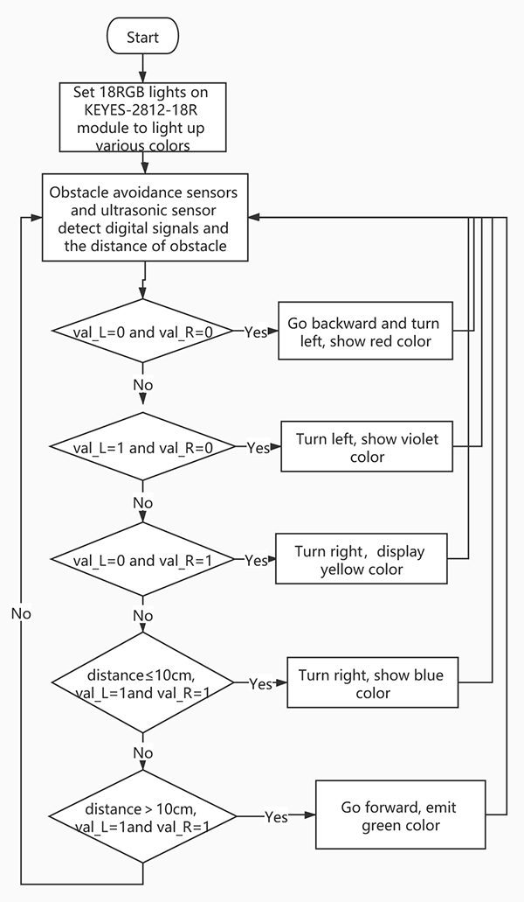

**4. Test Code：**

Open“6.20.2.py”in Mu software

（[How to load the project code?](#AS)）

| File Type   | Route                                                       | File Name |
|-------------|-------------------------------------------------------------|-----------|
| Python file | ../Python code/6.20：Obstacle avoidance&following robot car | 6.20.2.py |

You can also input code in the editing window yourself.(note:all English words
and symbols must be written in English)

Click“Files”to import the library file of“keyes_Bit_Car_Driver.py”to micro:bit
([How to import files?](#AW) )

If micro:bit has library, you don’t need to add one.

Click“Check”to examine error in the code. The program proves wrong if underlines
and cursors are shown.

After downloading code, keep USB cable connected, turn on the switch of robot
car. And tap“Flash”to download code to micro:bit board.

**5. Test Result：**

After downloading code, turn on the switch of robot car. As a result, the car
will avoid the obstacle automatically

**6.Code Explanation：**

| **from** keyes_Bit_Car_Driver **import \***                                                                                                                                                                                                                                                                                                                                                                                                                                                                                                                                                                                                                                                                                                                                                                                                                                                                                                                                                  | Import the library file of keyes_Bit_Car_Driver                                                                                                                                                                                                                                                                                                                                                                                                                                                                                                                                                                                                                                                                                                                                                                                                                                                                                                                                                                                                                                                                                                                                                                                                                                                                                                                                                                                          |
|----------------------------------------------------------------------------------------------------------------------------------------------------------------------------------------------------------------------------------------------------------------------------------------------------------------------------------------------------------------------------------------------------------------------------------------------------------------------------------------------------------------------------------------------------------------------------------------------------------------------------------------------------------------------------------------------------------------------------------------------------------------------------------------------------------------------------------------------------------------------------------------------------------------------------------------------------------------------------------------------|------------------------------------------------------------------------------------------------------------------------------------------------------------------------------------------------------------------------------------------------------------------------------------------------------------------------------------------------------------------------------------------------------------------------------------------------------------------------------------------------------------------------------------------------------------------------------------------------------------------------------------------------------------------------------------------------------------------------------------------------------------------------------------------------------------------------------------------------------------------------------------------------------------------------------------------------------------------------------------------------------------------------------------------------------------------------------------------------------------------------------------------------------------------------------------------------------------------------------------------------------------------------------------------------------------------------------------------------------------------------------------------------------------------------------------------|
| bitCar = Bit_Car_Driver()                                                                                                                                                                                                                                                                                                                                                                                                                                                                                                                                                                                                                                                                                                                                                                                                                                                                                                                                                                    | instantiate                                                                                                                                                                                                                                                                                                                                                                                                                                                                                                                                                                                                                                                                                                                                                                                                                                                                                                                                                                                                                                                                                                                                                                                                                                                                                                                                                                                                                              |
| **import** neopixel                                                                                                                                                                                                                                                                                                                                                                                                                                                                                                                                                                                                                                                                                                                                                                                                                                                                                                                                                                          | Import the library file of neopixel                                                                                                                                                                                                                                                                                                                                                                                                                                                                                                                                                                                                                                                                                                                                                                                                                                                                                                                                                                                                                                                                                                                                                                                                                                                                                                                                                                                                      |
| np = neopixel.NeoPixel(pin5, 18)                                                                                                                                                                                                                                                                                                                                                                                                                                                                                                                                                                                                                                                                                                                                                                                                                                                                                                                                                             | Initialize Neopixel                                                                                                                                                                                                                                                                                                                                                                                                                                                                                                                                                                                                                                                                                                                                                                                                                                                                                                                                                                                                                                                                                                                                                                                                                                                                                                                                                                                                                      |
| distance = 0                                                                                                                                                                                                                                                                                                                                                                                                                                                                                                                                                                                                                                                                                                                                                                                                                                                                                                                                                                                 | Set the initial value of distance to 0                                                                                                                                                                                                                                                                                                                                                                                                                                                                                                                                                                                                                                                                                                                                                                                                                                                                                                                                                                                                                                                                                                                                                                                                                                                                                                                                                                                                   |
| val_L = 0                                                                                                                                                                                                                                                                                                                                                                                                                                                                                                                                                                                                                                                                                                                                                                                                                                                                                                                                                                                    | Set the initial value of val_L to 0                                                                                                                                                                                                                                                                                                                                                                                                                                                                                                                                                                                                                                                                                                                                                                                                                                                                                                                                                                                                                                                                                                                                                                                                                                                                                                                                                                                                      |
| val_R = 0                                                                                                                                                                                                                                                                                                                                                                                                                                                                                                                                                                                                                                                                                                                                                                                                                                                                                                                                                                                    | Set the initial value of val_R to 0                                                                                                                                                                                                                                                                                                                                                                                                                                                                                                                                                                                                                                                                                                                                                                                                                                                                                                                                                                                                                                                                                                                                                                                                                                                                                                                                                                                                      |
| **while True:**                                                                                                                                                                                                                                                                                                                                                                                                                                                                                                                                                                                                                                                                                                                                                                                                                                                                                                                                                                              | This is a permanent loop that makes micro:bit execute the code of it.                                                                                                                                                                                                                                                                                                                                                                                                                                                                                                                                                                                                                                                                                                                                                                                                                                                                                                                                                                                                                                                                                                                                                                                                                                                                                                                                                                    |
| distance = bitCar.get_distance()                                                                                                                                                                                                                                                                                                                                                                                                                                                                                                                                                                                                                                                                                                                                                                                                                                                                                                                                                             | Set bitCar.get_distance() to variable distance                                                                                                                                                                                                                                                                                                                                                                                                                                                                                                                                                                                                                                                                                                                                                                                                                                                                                                                                                                                                                                                                                                                                                                                                                                                                                                                                                                                           |
| val_L = pin2.is_touched()                                                                                                                                                                                                                                                                                                                                                                                                                                                                                                                                                                                                                                                                                                                                                                                                                                                                                                                                                                    | Set the value of P2 read by pin2.is_touched() command, to val_LL                                                                                                                                                                                                                                                                                                                                                                                                                                                                                                                                                                                                                                                                                                                                                                                                                                                                                                                                                                                                                                                                                                                                                                                                                                                                                                                                                                         |
| val_R = pin11.read_digital()                                                                                                                                                                                                                                                                                                                                                                                                                                                                                                                                                                                                                                                                                                                                                                                                                                                                                                                                                                 | Set the digital signal read by P11 to val_RR                                                                                                                                                                                                                                                                                                                                                                                                                                                                                                                                                                                                                                                                                                                                                                                                                                                                                                                                                                                                                                                                                                                                                                                                                                                                                                                                                                                             |
| **if** val_L is True **and** val_R == 0: bitCar.motorL(0, 100) bitCar.motorR(0, 100) **for** pixel_id1 **in** range(0, len(np)): np[pixel_id1] = (250, 0, 0) np.show() sleep(1000) bitCar.motorL(0, 80) bitCar.motorR(1, 80) sleep(200) **elif** val_L is False **and** val_R == 0: bitCar.motorL(0, 80) bitCar.motorR(1, 80) **for** pixel_id1 **in** range(0, len(np)): np[pixel_id1] = (160, 32, 240) np.show() **elif** val_L is True **and** val_R == 1: bitCar.motorL(1, 80) bitCar.motorR(0, 80) **for** pixel_id1 **in** range(0, len(np)): np[pixel_id1] = (255, 255, 0) np.show() **elif** distance \<= 10 **and** val_L is False **and** val_R == 1: bitCar.motorL(1, 80) bitCar.motorR(0, 80) **for** pixel_id1 **in** range(0, len(np)): np[pixel_id1] = (0, 0, 255) np.show() **elif** distance \> 10 **and** val_L is False **and** val_R == 1: bitCar.motorL(1, 100) bitCar.motorR(1, 100) **for** pixel_id1 **in** range(0, len(np)): np[pixel_id1] = (0, 255, 0) np.show() | If val_L is True and val_R = 0 The left motor rotates clockwise at the speed of PWM100  The right motor rotates clockwise at the speed of PWM100 Set pixel of RGB to pixel_id1 Set pixel_id1 to show red color Set pixel on Neopixel strip Delay in 1000ms The left motor rotates anticlockwise at the speed of PWM80  The right motor rotates clockwise at the speed of PWM80 Delay in 200ms If val_L is False and val_R =0 The left motor rotates anticlockwise at the speed of PWM80  The right motor rotates clockwise at the speed of PWM80 Set pixel of RGB to pixel_id1 Set pixel_id1 to display purple color Set pixel on Neopixel strip If val_L is True and val_R = 1 The left motor rotates clockwise at the speed of PWM80   The right motor rotates anticlockwise at the speed of PWM80 Set pixel of RGB to pixel_id1 Set pixel_id1 to show yellow color Set pixel on Neopixel strip If distance ≤10 and val_L is False and val_R = 1 The left motor rotates clockwise at the speed of PWM80  The right motor rotates anticlockwise at the speed of PWM80 Set pixel of RGB to pixel_id1 Set pixel_id1 to display blue color Set pixel on Neopixel strip If distance \> 10 and val_L is False and val_R = 1 The left motor rotates clockwise at the speed of PWM100 The right motor rotates anticlockwise at the speed of PWM100 Set pixel of RGB to pixel_id1 Set pixel_id1 to show green color Set pixel on Neopixel strip |

6.20.3: Following Smart Car

**1.Description：**

In this chapter, we will integrate ultrasonic sensor, IR obstacle avoidance
sensor and car expansion board to make a multi-directional follow smart car. Its
principle is to detect the distance between the car and obstacle by ultrasonic
sensor and IR obstacle avoidance sensors and control the motion of smart car.

**What you need to get started**

1.  Insert micro:bit board into slot of V2 shield.

2.  Put batteries into battery holder

3.  Turn on the switch at the back of micro:bit car

4.  Link micro:bit board with computer via USB cable.

5.  Open the offline version of Mu

Warning: the obstacle avoidance sensor can't work normally under strong light
full of invisible light like IR and ultraviolet rays.

**Flow Chart:**

**4.Test Code：**

Open“6.20.3.py”in Mu

（[How to load the project code?](#AS)）

| File Type   | Route                                                       | File Name |
|-------------|-------------------------------------------------------------|-----------|
| Python file | ../Python code/6.20：Obstacle avoidance&following robot car | 6.20.3.py |

You can also input code in the editing window yourself.(note:all English words
and symbols must be written in English)

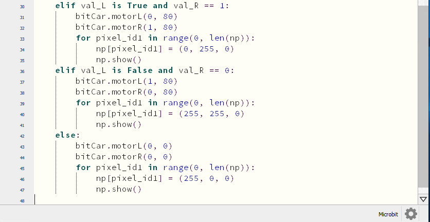

Click“Files”to import the library file of“keyes_Bit_Car_Driver.py to micro:bit
([How to import files?](#AW) )

If micro:bit has library, you don’t need to add one.

Click“Check”to examine error in the code. The program proves wrong if underlines
and cursors are shown.

**Make sure code correct, connect micro:bit to computer via USB cable, turn on
the switch of keyestudio micro:bit robot car and click“Flash”to download code to
micro:bit.**

**5.Test Result：**

After downloading code, turn on the switch of robot car, the car will follow the
obstacle to move.

**6.Code Explanation：**

| **from** keyes_Bit_Car_Driver **import \***                                                                                                                                                                                                                                                                                                                                                                                                                                                                                                                                                                                                                                                                                                                                                                                                                                                                                                                                                                                                                                                         | Import the library file of keyes_Bit_Car_Driver                                                                                                                                                                                                                                                                                                                                                                                                                                                                                                                                                                                                                                                                                                                                                                                                                                                                                                                                                                                                                                                                                                                                                                                                                                                                                                                                                                                                                                               |
|-----------------------------------------------------------------------------------------------------------------------------------------------------------------------------------------------------------------------------------------------------------------------------------------------------------------------------------------------------------------------------------------------------------------------------------------------------------------------------------------------------------------------------------------------------------------------------------------------------------------------------------------------------------------------------------------------------------------------------------------------------------------------------------------------------------------------------------------------------------------------------------------------------------------------------------------------------------------------------------------------------------------------------------------------------------------------------------------------------|-----------------------------------------------------------------------------------------------------------------------------------------------------------------------------------------------------------------------------------------------------------------------------------------------------------------------------------------------------------------------------------------------------------------------------------------------------------------------------------------------------------------------------------------------------------------------------------------------------------------------------------------------------------------------------------------------------------------------------------------------------------------------------------------------------------------------------------------------------------------------------------------------------------------------------------------------------------------------------------------------------------------------------------------------------------------------------------------------------------------------------------------------------------------------------------------------------------------------------------------------------------------------------------------------------------------------------------------------------------------------------------------------------------------------------------------------------------------------------------------------|
| bitCar = Bit_Car_Driver()                                                                                                                                                                                                                                                                                                                                                                                                                                                                                                                                                                                                                                                                                                                                                                                                                                                                                                                                                                                                                                                                           |  instantiate                                                                                                                                                                                                                                                                                                                                                                                                                                                                                                                                                                                                                                                                                                                                                                                                                                                                                                                                                                                                                                                                                                                                                                                                                                                                                                                                                                                                                                                                                  |
| **import** neopixel                                                                                                                                                                                                                                                                                                                                                                                                                                                                                                                                                                                                                                                                                                                                                                                                                                                                                                                                                                                                                                                                                 | Import the library file of neopixel                                                                                                                                                                                                                                                                                                                                                                                                                                                                                                                                                                                                                                                                                                                                                                                                                                                                                                                                                                                                                                                                                                                                                                                                                                                                                                                                                                                                                                                           |
| np = neopixel.NeoPixel(pin5, 18)                                                                                                                                                                                                                                                                                                                                                                                                                                                                                                                                                                                                                                                                                                                                                                                                                                                                                                                                                                                                                                                                    | Initialize Neopixel                                                                                                                                                                                                                                                                                                                                                                                                                                                                                                                                                                                                                                                                                                                                                                                                                                                                                                                                                                                                                                                                                                                                                                                                                                                                                                                                                                                                                                                                           |
| distance = 0                                                                                                                                                                                                                                                                                                                                                                                                                                                                                                                                                                                                                                                                                                                                                                                                                                                                                                                                                                                                                                                                                        | Set the initial value of distance to 0                                                                                                                                                                                                                                                                                                                                                                                                                                                                                                                                                                                                                                                                                                                                                                                                                                                                                                                                                                                                                                                                                                                                                                                                                                                                                                                                                                                                                                                        |
| val_L = 0                                                                                                                                                                                                                                                                                                                                                                                                                                                                                                                                                                                                                                                                                                                                                                                                                                                                                                                                                                                                                                                                                           | Set the initial value of val_L to 0                                                                                                                                                                                                                                                                                                                                                                                                                                                                                                                                                                                                                                                                                                                                                                                                                                                                                                                                                                                                                                                                                                                                                                                                                                                                                                                                                                                                                                                           |
| val_R = 0                                                                                                                                                                                                                                                                                                                                                                                                                                                                                                                                                                                                                                                                                                                                                                                                                                                                                                                                                                                                                                                                                           | Set the initial value of val_R to 0                                                                                                                                                                                                                                                                                                                                                                                                                                                                                                                                                                                                                                                                                                                                                                                                                                                                                                                                                                                                                                                                                                                                                                                                                                                                                                                                                                                                                                                           |
| **while True:**                                                                                                                                                                                                                                                                                                                                                                                                                                                                                                                                                                                                                                                                                                                                                                                                                                                                                                                                                                                                                                                                                     | This is a permanent loop that makes micro:bit execute the code of it.                                                                                                                                                                                                                                                                                                                                                                                                                                                                                                                                                                                                                                                                                                                                                                                                                                                                                                                                                                                                                                                                                                                                                                                                                                                                                                                                                                                                                         |
| distance = bitCar.get_distance()                                                                                                                                                                                                                                                                                                                                                                                                                                                                                                                                                                                                                                                                                                                                                                                                                                                                                                                                                                                                                                                                    | Set bitCar.get_distance() to distance                                                                                                                                                                                                                                                                                                                                                                                                                                                                                                                                                                                                                                                                                                                                                                                                                                                                                                                                                                                                                                                                                                                                                                                                                                                                                                                                                                                                                                                         |
| val_L = pin2.is_touched()                                                                                                                                                                                                                                                                                                                                                                                                                                                                                                                                                                                                                                                                                                                                                                                                                                                                                                                                                                                                                                                                           | Set the value of P2 read by pin2.is_touched()z command, to val_LL                                                                                                                                                                                                                                                                                                                                                                                                                                                                                                                                                                                                                                                                                                                                                                                                                                                                                                                                                                                                                                                                                                                                                                                                                                                                                                                                                                                                                             |
| val_R = pin11.read_digital()                                                                                                                                                                                                                                                                                                                                                                                                                                                                                                                                                                                                                                                                                                                                                                                                                                                                                                                                                                                                                                                                        | Set the digital signal read by P11 to val_RR                                                                                                                                                                                                                                                                                                                                                                                                                                                                                                                                                                                                                                                                                                                                                                                                                                                                                                                                                                                                                                                                                                                                                                                                                                                                                                                                                                                                                                                  |
| **if** distance \> 3 **and** distance \<= 6 **and** val_L is False **and** val_R == 1: bitCar.motorL(0, 0) bitCar.motorR(0, 0) **for** pixel_id1 **in** range(0, len(np)): np[pixel_id1] = (250, 0, 0) np.show() **elif** distance \<= 3 **or** val_L is True **and** val_R == 0: bitCar.motorL(0, 80) bitCar.motorR(0, 80) **for** pixel_id1 **in** range(0, len(np)): np[pixel_id1] = (160, 32, 240) np.show() **elif** distance \> 6 **and** val_L is False **and** val_R == 1: bitCar.motorL(1, 80) bitCar.motorR(1, 80) **for** pixel_id1 **in** range(0, len(np)): np[pixel_id1] = (0, 0, 255) np.show() **elif** val_L is True **and** val_R == 1: bitCar.motorL(0, 80) bitCar.motorR(1, 80) **for** pixel_id1 **in** range(0, len(np)): np[pixel_id1] = (0, 255, 0) np.show() **elif** val_L is False **and** val_R == 0: bitCar.motorL(1, 80) bitCar.motorR(0, 80) **for** pixel_id1 **in** range(0, len(np)): np[pixel_id1] = (255, 255, 0) np.show() **else**: bitCar.motorL(0, 0) bitCar.motorR(0, 0) **for** pixel_id1 **in** range(0, len(np)): np[pixel_id1] = (255, 0, 0) np.show() | If distance \> 3 and distance ≤ 6 val_L is False, val_R =1 left motor doesn’t rotate right motor doesn’t rotate Set the pixel of RGB to pixel_id1 in the range of 0-len（np） Set pixel_id1to show red color Set pixel of RGB to pixel_id1 If distance ≤ 3 or val_L is True and val_R = 0 The left motor rotates anticlockwise at the speed of PWM80 The right motor rotates anticlockwise at the speed of PWM80 Set pixel of RGB to pixel_id1 Set pixel_id1 to display purple color Display pixel on Neopixel strip Otherwise, if distance \> 6 and val_L is False and val_R =1 The left motor rotates clockwise at the speed of PWM80 The right motor rotates clockwise at the speed of PWM80 Set pixel of RGB to pixel_id1 Set pixel_id1to show blue color Display pixel on Neopixel strip If val_L is True and val_R = 1 The left motor rotates anticlockwise at the speed of PWM80 The right motor rotates clockwise at the speed of PWM80 Set pixel of RGB to pixel_id1 Set pixel_id1 to show green color Display pixel on Neopixel strip If val_L is False and val_R = 1 The left motor rotates clockwise at the speed of PWM80 The right motor rotates anticlockwise at the speed of PWM80 Set pixel of RGB to pixel_id1 Set pixel_id1 to display yellow color Display pixel on Neopixel strip If the above conditions are not met left motor doesn’t rotate right motor doesn’t rotate Set pixel of RGB to pixel_id1 Set pixel_id1 to show red color Display pixel on Neopixel strip |

## 6.21: Multi-purpose Smart Car

With 16k RAM, micro:bit owns a low-consumption Bluetooth module and support
Bluetooth communication. However, BLE heap stack occupies 12K RAM, which implies
that there is no enough space to run microPython.

At present, microPython doesn’t support Bluetooth, thereby, we can’t make a
multi-purpose smart car.

<https://microbit-micropython.readthedocs.io/en/latest/ble.html>

# 9. Resources

1\. BBC Micro：bit Micro Python：

<https://microbit-micropython.readthedocs.io/en/latest/tutorials/introduction.html>

1.  The Micro Python language[https://docs.openmv.io/reference/index.html -
    the-micropython-language](https://docs.openmv.io/reference/index.html#the-micropython-language)

<https://docs.openmv.io/reference/index.html>

1.  **Ustruct Library：**

<https://docs.openmv.io/library/ustruct.html>

1.  Math Library：

<https://docs.openmv.io/library/math.html>

5.utime(sleep_us,tick_us) Library File：

[https://docs.openmv.io/library/utime.html\#](https://docs.openmv.io/library/utime.html)

# 
